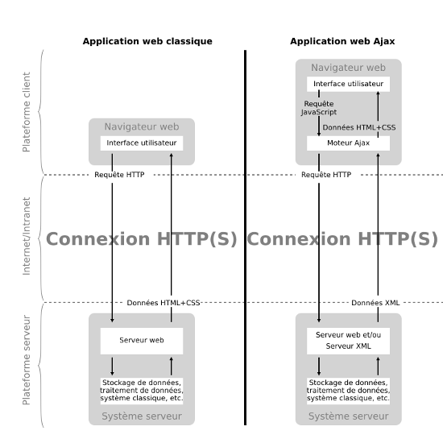

% S'initier à XML
% Didier RICHARD - IGN/DRE/ValiLab
% 04/12/2015

# XML #

## Fondements des langages à balises ##

* Langage pour décrire sous forme textuelle la structure et le contenu d’un
  document.
* En XML, possibilité d’inventer de nouvelles balises: langage ouvert et
  extensible… mais attention des règles à respecter en terme de structuration.
* Attention, la mise en forme ne se fait qu’à l’aide d’une feuille de style
  externe (CSS ou autre…)

## XML, une recommandation W3C ##

* XML est un métalangage qui est reconnu standard (utilisé en JAVA par
  exemple) …
* XML permet de délimiter précisément certaines parties d’une entité de données
  => XML est un langage parfaitement adapté à l’échange de données informatisées
* il existe des extensions propres à des domaines donnés :
    * `mathML` pour les mathématiques ;
    * `KML` pour l’information géographique ;
    * `cityGML` pour la représentation des constructions ;
    * ...

## Documents bien formés et documents valides ##

* Les documents bien formés respectent la syntaxe de XML (voir chapitre
  suivant), autrement dit pas d’erreurs dans les balises et les attributs: un
  parser XML ne générera pas d’erreur
* Un document valide est un document bien formé qui respecte la structure
  définie dans une DTD (Document Definition Type) ou un XSD (XML Schema
  Definition)
* Remarque: XML fait la différence entre les minuscules et les majuscules!

## Structure d’un document XML (1/3) ##

* __Prologue facultatif (mais recommandé) contenant des déclarations__

```xml
<?xml version="1.0" encoding="UTF-8" standalone="yes" ?>
```

* Arbre d’éléments correspondant au contenu du document
* Des commentaires et des instructions de traitement (facultatifs)

## Structure d’un document XML (2/3) ##

* Prologue facultatif (mais recommandé) contenant des déclarations
* __Arbre d’éléments correspondant au contenu du document__
    * Chaque élément se compose d’une balise d’ouverture, d’un contenu et d’une
      balise de fermeture
    * Un contenu vide peut se noter `<nomBalise />`
    * Un élément peut porter un ou plusieurs attributs `<nomBalise nomAttribut="valeur"> ... </nomBalise>`
      ou `<nomBalise nomAttribut="valeur"/>`
    * Tout élément fils est complètement inclus dans son élément père
    * Pas de recouvrement entre frères
    * Dans un document il y a un et un seul élément père qui contient tous les
      autres éléments (une seule racine)
* Des commentaires et des instructions de traitement (facultatifs)

## Structure d’un document XML (3/3) ##

* Prologue facultatif (mais recommandé) contenant des déclarations
* Arbre d’éléments correspondant au contenu du document
* __Des commentaires et des instructions de traitement (facultatifs)__

```xml
<!-- mon commentaire-->
```

# Prologue #

## Encodage des caractères ##

* On peut utiliser de nombreux codages de caractères. Les plus courants sont:
    * UTF-8 qui code sur une séquence d’octets variables de 1 à 6, il permet de
      coder tous les caractères de l’Universal Character Set (ISO 10646)
    * ASCII qui code sur 1 caractère
    * ISO-8859-1 correspond au latin sur 8 bits et permet d’avoir nos caractères
      spéciaux reconnus

    ```xml
    <?xml version="1.0" encoding="UTF-8" standalone="yes" ?>
    ```

## Exercice n°1 ##

1. Écrire en XML les informations suivantes :
    * je suis une personne
        * mon nom est ...
        * mon prénom est ...
        * mon employeur est ...
        * j'appartiens à la direction ...
        * qui héberge le service où je travaille ...
        * qui contient ... agents
        * ma fonction est ...
        * mon lieu de travail est ...
        * dont l'adresse est ...

2. Concaténer ces informations pour tous les stagiaires

Les ... sont de l'information à mettre dans le fichier XML !


# DTD #

## Définition ##

* La DTD (Document Type Definition) permet de décrire précisément le jeu de
  balises possibles et les constructions autorisées avec un formalisme proche
  d’une grammaire
* Il y a quatre possibilités de faire référence à une DTD
    * Une DTD interne
    * Une DTD externe
    * Des entités internes (ou jeux de remplacement)
    * Des entités externes adressées par URL

## DTD interne ##

```xml
<?xml version="1.0" encoding="UTF-8" standalone="yes"?>
<!DOCTYPE exemple [
<!ELEMENT exemple (p+)>
<!ELEMENT p (#PCDATA)>
]>
<exemple> 
   <p> ma lettre </p>
   <p> Veuillez agréer, Madame, Monsieur, à l’expression de mes salutations distinguées </p>
</exemple>
```

Le nom suivant `DOCTYPE` est le nom de la balise racine ...

## DTD externe (1/2) ##

```xml
<?xml version="1.0" encoding="UTF-8" standalone="no"?>
<!DOCTYPE exemple SYSTEM "ex.dtd">
<exemple> 
   <p> ma lettre </p>
   <p> Veuillez agréer, Madame, Monsieur, à l’expression de mes salutations distinguées </p>
</exemple>
```

On remarquera **standalone à "no"**

* contenu de la DTD ex.dtd :

```xml
<!-- début de la DTD -->
<!ELEMENT exemple (p+)>
<!ELEMENT p (#PCDATA)>
<!-- fin de la DTD -->
```

## DTD externe (2/2) ##

* une DTD externe peut être :
    * `SYSTEM` : locale à l'ordinateur
    * `PUBLIC` : accessible par un URL

## Entités internes ##

* Des entités internes (ou jeux de remplacement)
    * à mettre en fin de prologue des entités ayant une valeur de remplacement

    ```xml
<?xml version="1.0" encoding="UTF-8" standalone="yes"?>
<!DOCTYPE exemple [
<!-- début de la DTD -->
<!ELEMENT exemple (p+)>
<!ELEMENT p (#PCDATA)>
<!ENTITY formule-politesse "Veuillez agréer, &mme-m; à l’expression de mes salutations distinguées">
<!ENTITY mme-m "Madame, Monsieur,">
<!-- fin de la DTD -->
<exemple> 
   <p> ma lettre </p>
   <p> &formule-politesse; </p>
</exemple>
    ```

## Entités externes (1/2) ##

* Des entités externes adressées par URL (**standalone à "no"**)

```xml
<?xml version="1.0" encoding="ISO-8859-1" standalone="no"?>
<!DOCTYPE exemple [
<!-- début de la DTD -->
<!ELEMENT exemple (p+)>
<!ELEMENT p (#PCDATA)>
<!ENTITY entete SYSTEM "part1.xml">
<!ENTITY % formule-politesse-dtd PUBLIC "-//W3C//ENTITIES formule" "http://serveur-public.net/formule.dtd">
&formule-politesse-dtd;
<!ENTITY mme-m "Madame, Monsieur,">
<!-- fin de la DTD -->
<exemple> 
   &entete;
   <p> &formule-politesse; </p>
</exemple>
```

## Entités externes (2/2) ##

* fichier part1.xml (locale à l'ordinateur, déclarée `SYSTEM`) :

```xml
   <p> ma lettre </p>
```

* fichier formule.dtd (accessible par internet, déclarée `PUBLIC`) :

```xml
 <!ENTITY formule-politesse "Veuillez agréer, &mme-m; à l’expression de mes salutations distinguées">
```

## Entités prédéfinies ##

* Certains caractères ayant un sens précis en XML, on a recours dans ce cas à
des entités prédéfinies :

+-------------------+------------+
| Caractère spécial | Entité XML |
+===================+============+
| &                 | \&amp;     |
+-------------------+------------+
| <                 | \&lt;      |
+-------------------+------------+
| \>                | \&gt;      |
+-------------------+------------+
| "                 | \&quot;    |
+-------------------+------------+
| '                 | \&aquot;   |
+-------------------+------------+

## Entités prédéfinies externes ##

Il n'existe pas d'entité prédéfinie pour les lettres accentuées ou pour les
alphabets latins. Il faut utiliser à la place les entités numériques du type
`&#n;` (où n est une valeur décimale). La valeur numérique correspond au code
ISO 10646 ; par exemple le caractère é est codé par l'entité numérique &#233;.

Il est néanmoins possible d'importer des entités en provenance d'une autre DTD
:

```xml
<!ENTITY % HTMLsymbol PUBLIC "-//W3C//ENTITIES Symbols//EN//HTML">
...
%HTMLsymbol;
```

On récupère ainsi des symboles &#8730; (\&radic;), &#8592; (\&larr;) ...

## Syntaxe d'un élément (1/2) ##

* un élément se déclare comme suit, le `nom` sera celui de la balise, le
  `modèle` sera le contenu de la balise :

```xml
<!ELEMENT nom modèle>
```

* un élément peut être vide :

```xml
<!ELEMENT espace EMPTY>
```

* un élément peut contenir n'importe quoi ...

```xml
<!ELEMENT fourre-tout ANY>
```

## Syntaxe d'un élément (2/2) ##

* un élément peut contenir d'autres éléments :
    * ces fils peuvent être dans un ordre imposé, le séparateur est alors
      une virgule ;
    * s’il n’y a pas d’ordre, le séparateur est `|` ;
    * si l’élément est suivi de :
        * rien : il n’apparaît qu’une et une seule fois ;
        * `?` : il apparaît 0 ou 1 fois ;
        * `*` : il apparaît de 0 à n fois ;
        * `+` : il apparaît de 1 à n fois.

    ```xml
<!ELEMENT chapitre (titre, paragraphe+)>
<!ELEMENT fileAttente (homme|femme)*>
    ```

## Déclaration d’un élément ##

* un élément peut contenir des données textuelles indiquées par la valeur
   `PCDATA` (Parsed Character Data) ou un modèle mixte comme suit (dans ce
   cas `#PCDATA` est **toujours en premier** dans la liste :

```xml
<!ELEMENT p (#PCDATA)>
<!ELEMENT p (#PCDATA|note)*>
```

## Déclaration d’un attribut ##

* on peut déclarer une liste d’attributs pour un élément :

```xml
<!ATTLIST nomElement nomAtribut typeAttribut valeurAttribut>
```

* les valeurs des attributs seront toujours entre guillements simples ou
    doubles ;
* **Attention** : les noms d’attributs sont sensibles à la casse ;
* un attribut ne peut commencer par `xml:` ou `XML:` qui sont réservés ;

## Déclaration d’attributs ##

* on peut déclarer plusieurs attributs :

```xml
<!ATTLIST nomElement
   nomAtribut1 typeAttribut1 valeurAttribut1
   nomAtribut2 typeAttribut2 valeurAttribut2
   nomAtribut3 typeAttribut3 valeurAttribut3
>
```

## Type d’un attribut (1/2) ##

* chaîne de caractères quelconques `CDATA` :

```xml
<!ATTLIST humain nom CDATA>
```

* identifiant `ID` (équivalent à des liens web, pas à des identificateurs de
  base de données auquel cas c'est `NMTOKEN` ou `NMTOKENS`) :

```xml
<!ATTLIST humain matricule ID>
<!ATTLIST humain numero NMTOKEN>
```

* référence à un identifiant `IDREF` ou des identifiants `IDREFS` :

```xml
<!ATTLIST humain adresse IDREF>
```

## Type d’un attribut (2/2) ##

* liste de valeurs `(valeur1|valeur2|...)`

```xml
<!ATTLIST humain sexe (homme|femme)>
```

* autres types : `NOTATION`, `ENTITY`, `ENTITIES` sont réservés à l'usage des entités externes non XML

```xml
<!NOTATION PNG PUBLIC  "http://www.w3.org/TR/REC-png">
<!ENTITY photoMaison SYSTEM "ma-maison.png" NDATA PNG>
<!ELEMENT image EMPTY>
<!ATTLIST image src ENTITY #REQUIRED>
...
<image src="photoMaison"/> <!-- pas de &photoMaison; -->
```

## Valeur d'un attribut ##

* un attribut peut être facultatif :

```xml
<!ATTLIST humain salaire CDATA #IMPLIED>
```

* un attribut peut être obligatoire :

```xml
<!ATTLIST humain matricule ID #REQUIRED>
```

* un attribut peut avoir une valeur par défaut :

```xml
<!ATTLIST humain nom CDATA "Martin">
<!ATTLIST humain sexe (homme|femme) "homme">
```

* un attribut peut avoir une valeur constante :

```xml
<!ATTLIST humain unique CDATA #FIXED "TRUE">
```

## Exercice n°2 ##

1. Écrire une DTD pour l'exercice n°1
2. Modifier le fichier XML de l'exercice n°1 pour :
    * utiliser la DTD en interne ;
    * utiliser la DTD en externe.


# Espace de noms #

## À quoi ça sert ? ##

* Les espaces de noms (namespaces) permettent de regrouper les éléments XML
  autour d’une bannière unique (un vocabulaire) ;
* Les éléments appartenant à un espace de noms se distinguent des autres
  éléments par l'ajout d'un préfixe symbolisant cette singularité
  (ré-utilisation);
* Les préfixes d'espace de noms se placent au sein d'un marqueur XML, avant le
  nom de l'élément et séparés par le caractère deux-points (`:`).

```xml
<prefixe:balise> contenu </prefixe:balise>
```

## Utilisation d'un espace de noms ##

* Les espaces de noms peuvent être déclarés dans les éléments contenant les
  préfixes d'espace de noms ou pour plus de clarté et de commodité dans
  l'élément racine, par l'intermédiaire de l'attribut `xmlns` :

```xml
<prefixe:baliseRacine xmlns:prefixe="URI">
  <prefixe:baliseFille> ... </prefixe:baliseFille>
</prefixe:baliseRacine>
```

## Espaces de noms multiples ##
 
* Les espaces de noms multiples permettent d'accueillir au sein d'un élément
  parent, plusieurs préfixes différents :

```xml
<prefixe1:baliseParent xmlns:prefixe1="URI1" xmlns:prefixe2="URI2">
  <prefixe1:fils> ... </prefixe1:fils>
  <prefixe2:fils> ... </prefixe2:fils>
</prefixe1:baliseParent>
```

## Espace implicite ##

* Un espace de noms implicite évite la répétition du préfixe dans les marqueurs
  XML tout au long du document. Sauf spécifications contraires, tous les
  éléments fils appartiendront au même espace de noms par défaut :

```xml
<balise xmlns="URI">
  <fils> ... </fils> <!-- fils est dans le même espace de nommage -->
</balise>
```

## Définition d'un espace de noms (1/2) ##

* La déclaration de l'attribut de déclaration d'espace de noms (`xmlns`), dans
  la Définition de Type de Document (DTD) s'effectue comme suit :

```xml
<!ELEMENT prefixe:balise modèle>
<!ATTLIST prefixe:balise xmlns:prefixe CDATA (#REQUIRED| #IMPLIED | #FIXED "URI")>
```

Par exemple :

```xml
<!ELEMENT prefixe:balise (#PCDATA)>
<!ATTLIST prefixe:balise xmlns:prefixe CDATA #FIXED "URI">
...
<prefixe:balise xmlns:prefixe="URI"> contenu </prefixe:balise>
```

## Définition d'un espace de noms (2/2) ##

* Les éléments et attributs compris dans un espace de noms doivent être déclarés
  avec leur nom qualifié :

```xml
<!ELEMENT prefixe:balise modèle>
<!ATTLIST prefixe:balise xmlns:prefixe CDATA (#REQUIRED| #IMPLIED | #FIXED "URI")> 
<!ATTLIST prefixe:balise xmlns:prefixeAttribut CDATA (#REQUIRED| #IMPLIED | #FIXED "URI2")> 
<!ATTLIST prefixe:balise prefixeAttribut:nom CDATA>
```

Par exemple :

```xml
<!ELEMENT prefixe:balise (#PCDATA)>
<!ATTLIST prefixe:balise xmlns:prefixe CDATA #FIXED "URI"> 
<!ATTLIST prefixe:balise xmlns:prefixeAttribut CDATA #REQUIRED> 
<!ATTLIST prefixe:balise prefixeAttribut:nom spécifications>
...
<prefixe:balise xmlns:prefixe="URI" xmlns:prefixeAttribut="URI2" prefixeAttribut:nom="XML">
  contenu
</prefixe:balise>
```

## Exercice n°3 ##

Valider le fichier XML des stagiaires de cette formation utilisant la DTD interne.
Pour cela :

1. Identifier via un moteur de recherche les services en ligne pour valider un tel fichier ;
2. Utiliser au moins un service pour valider votre fichier.

```bash
$ xmllint --noout --valid fichier.xml
$ CLASS_PATH=.:$XERCES_HOME/xercesImpl.ja:$XERCES_HOME/xml-apis.jar:$XERCES_HOME/xercesSamples.jar java sax.Counter -v fichier.xml
```


# AJAX #

## Principes ##

* Pouvoir mettre-à-jour des parties d'une page web et non sa totalité :
    * XML a été utilisé pour transmettre de l'information structurée depuis le
      serveur vers les client (navigateur) ;
    * Une requête est envoyée, à l'arrivée de la réponse, la page web est mise à
      jour. Le navigateur n'attend pas la réponse (mode asynchrone) ;
    * La combinaison JavaScript / XML via la méthode *XmlHttpRequest* a permis
      l'émergence du Web 2.0

## Architecture ##




# Des questions ? #

## Merci de votre attention ! ##

À voir sur le net :

* http://xml.developpez.com/cours/
* http://www.liafa.jussieu.fr/~carton/Enseignement/XML/Cours/
* http://www.gchagnon.fr/cours/xml/index.html


<div class="notes">
* Validateurs :
    * [W3C](https://validator.w3.org/ "W3C")
    * [Validome DTD](http://www.validome.org/grammar/ "Validome DTD")
    * [Validome XML](http://www.validome.org/xml/ "Validome XML")
    * [W3 School](http://www.w3schools.com/xml/xml_validator.asp "W3 School")
    * [New Studio](http://xmlvalidator.new-studio.org/ "New Studio")
* document généré via :

```bash
pandoc -s -t revealjs --slide-level=2 --section-divs --template=template/ign-ensg-revealjs.html --email-obfuscation=none --css=css/ign.css --highlight-style=kate -V revealjs-url=externals/reveal.js -V slideNumber=true -V transition=none -o XML1-A-slides.html XML1-A-slides.md
```

* version des diapositives : 2.2.0
</div>

