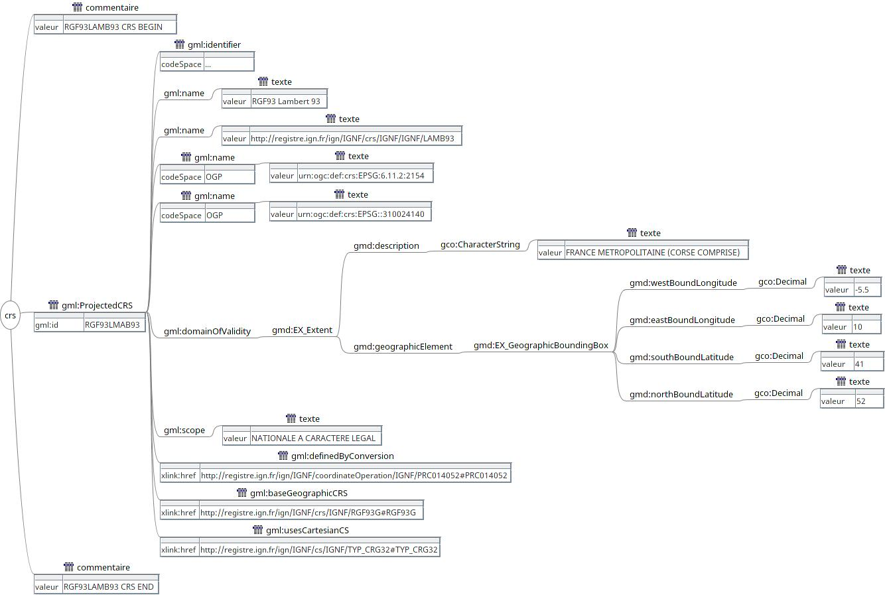

% Initiation à XML - partie I
% Véronique Lemaire, Didier Richard
% rèv. 2.3.0 du 21/08/2016

---

\newpage

# Découverte d’XML #


## Fiche pédagogique ##

Cours en deux jours (4 fois 3 heures).
Ce cours constitue les 2 fois 3 premières heures.

Notes de [cours](XML1-a-slides).


### Objectif ###

* Initiation à XML, sa syntaxe (1er jour) ;
* Initiation à XML Schema et XSL (2nd jour).


### Pré-requis ###

* Notion de programmation ;
* Manipulation d'un éditeur de textes.


### Auteurs ###

© IGN 2009 - Véronique Lemaire - Département Informatique (ENSG)\
© IGN 2015 - Didier Richard - ValiLab (DRE)


---

\newpage

## XML : un ensemble de langages ##

XML[^xml] signifie e**X**tended **M**arkup **L**anguage : il permet de décrire
dans un format texte (lisible par l'être humain) la structure et le contenu
d’un document (analysable par un logiciel).

_Exemple d’un extrait de fichier XML (mis en page pour être lisible) :_

```xml
<crs><!--RGF93LAMB93 CRS BEGIN-->
    <gml:ProjectedCRS gml:id="RGF93LAMB93">
        <gml:identifier codeSpace="http://registre.ign.fr/ign">
            http://registre.ign.fr/ign/IGNF/crs/IGNF/RGF93LAMB93
        </gml:identifier>
        <gml:name>RGF93 Lambert 93</gml:name>
        <gml:name>http://registre.ign.fr/ign/IGNF/crs/IGNF/IGNF/LAMB93</gml:name>
        <gml:name codeSpace="OGP">urn:ogc:def:crs:EPSG:6.11.2:2154</gml:name>
        <gml:name codeSpace="OGP">urn:ogc:def:crs:EPSG::310024140</gml:name>
        <gml:domainOfValidity>
            <gmd:EX_Extent>
                <gmd:description>
                    <gco:CharacterString>
                        FRANCE METROPOLITAINE (CORSE COMPRISE)
                    </gco:CharacterString>
                </gmd:description>
                <gmd:geographicElement>
                    <gmd:EX_GeographicBoundingBox>
                        <gmd:westBoundLongitude>
                            <gco:Decimal>-5.5</gco:Decimal>
                        </gmd:westBoundLongitude>
                        <gmd:eastBoundLongitude>
                            <gco:Decimal>10</gco:Decimal>
                        </gmd:eastBoundLongitude>
                        <gmd:southBoundLatitude>
                            <gco:Decimal>41</gco:Decimal>
                        </gmd:southBoundLatitude>
                        <gmd:northBoundLatitude>
                            <gco:Decimal>52</gco:Decimal>
                        </gmd:northBoundLatitude>
                    </gmd:EX_GeographicBoundingBox>
                </gmd:geographicElement>
            </gmd:EX_Extent>
        </gml:domainOfValidity>
        <gml:scope>NATIONALE A CARACTERE LEGAL</gml:scope>
        <gml:definedByConversion
            xlink:href="http://registre.ign.fr/ign/IGNF/coordinateOperation/IGNF/PRC014052#PRC014052"/>
        <gml:baseGeographicCRS
            xlink:href="http://registre.ign.fr/ign/IGNF/crs/IGNF/RGF93G#RGF93G"/>
        <gml:usesCartesianCS
            xlink:href="http://registre.ign.fr/ign/IGNF/cs/IGNF/TYP_CRG32#TYP_CRG32"/>
    </gml:ProjectedCRS>
</crs><!--RGF93LAMB93 CRS END-->
```

\newpage

#### Caractéristiques du XML ####

Il est dérivé de SGML (**S**tandard **G**eneralized **M**arkup **L**anguage)[^sgml]
de façon à être adapté aux nouvelles technologies de la communication (Web).
Il constitue un standard maintenu par le groupement W3C[^w3c] et chapeaute un
ensemble de langages dérivés comme XSD[^xsd], XSL[^xsl] avec XSLT[^xslt] et
XPath[^xpath] ou bien encore SVG[^svg], etc …

À l’inverse d’HTML (**H**yper**T**ext **M**arkup **L**anguage)[^html] qui
offre des possibilités de mise en forme interne (même si dans ce
contexte aussi il est préférable d’utiliser le formalisme CSS à cet effet),
les documents XML ne peuvent pas comporter de mise en forme (police en gras,
couleur, etc …).
La mise en forme est alors assurée par un formalisme dédié : XSL[^xsl].

XSL est décomposé en XSLT[^xslt] (langage de transformation), XPath[^xpath]
(langage de navigation au sein d’un document XML) et XSL-FO[^xsl-fo] (langage
de formatage de la sémantique) et signifie e**X**tensible **S**tylesheet
**L**anguage et permet d’ajouter une mise en forme à tout document textuel.

XML offre la possibilité d’inventer de nouvelles balises ; il est donc ouvert et
extensible (comme son nom l’indique !).
XML est un métalangage en ce sens qu'il permet de créer d'autres langages,
plutôt appelés des vocabulaires.
Cependant des règles encadrent la manière dont on peut créer ces balises en
utilisant une structuration strictement hiérarchique (**notion d'arbre**).

\newpage

_Exemple du même extrait XML sous forme d'arbre :_



Le contrôle de la structure du document est assuré soit par la DTD
(**D**ocument **T**ype **D**efinition)[^dtd], soit par un XSD.
Si la DTD assure la description de la structure, le XSD permet d’adjoindre à
cette description un contrôle de type[^validator].
Enfin, il a été introduit en 2006 le Schematron[^schematron] qui permet de
décrire des règles de cohérence sur le contenu même des balises et de faire
donc des vérifications plus poussées que celles permises par les XSD.

Du XML a dérivé une nouvelle spécification de HTML, le XHTML[^xhtml] qui
impose au programmeur web de suivre les règles d’encodage du XML ... ce qui
n'a pas été vraiment un moyen pour faire adopter cette recommandation par les
développeurs !

Où trouve-t-on du XML ? ...

_Partout !_

\newpage

Éditons un document LibreOffice qui contient la chaîne « Test !»  
Éditons un document MicrosoftOffice qui contient la même chaîne ...  
Ces deux documents sont en fait des archives compressées (`zip`) :

```bash
odt$ unzip test-xml.odt 
Archive:  test-xml.odt
 extracting: mimetype                
 extracting: Thumbnails/thumbnail.png  
  inflating: content.xml             
  inflating: settings.xml            
  inflating: meta.xml                
  inflating: styles.xml              
  inflating: manifest.rdf            
   creating: Configurations2/images/Bitmaps/
   creating: Configurations2/toolpanel/
   creating: Configurations2/progressbar/
  inflating: Configurations2/accelerator/current.xml  
   creating: Configurations2/floater/
   creating: Configurations2/statusbar/
   creating: Configurations2/toolbar/
   creating: Configurations2/popupmenu/
   creating: Configurations2/menubar/
  inflating: META-INF/manifest.xml   
```

et

```bash
docx$ unzip test-xml.docx 
Archive:  test-xml.docx
  inflating: [Content_Types].xml     
  inflating: _rels/.rels             
  inflating: word/_rels/document.xml.rels  
  inflating: word/document.xml       
  inflating: word/theme/theme1.xml   
  inflating: word/settings.xml       
  inflating: word/webSettings.xml    
  inflating: word/stylesWithEffects.xml  
  inflating: docProps/core.xml       
  inflating: word/styles.xml         
  inflating: word/fontTable.xml      
  inflating: docProps/app.xml        
```

En fait, ces documents sont des collections de xml ! Le texte se trouve dans
les fichier `content.xml` et `word/document.xml`.

On retrouve XML dans les technologies du web ...

\newpage

### Asynchronous JavaScript And XML (AJAX) ###

AJAX (**A**synchronous **J**avascript **A**nd **X**ML) permet de construire des
applications Web et des sites web dynamiques interactifs sur le poste client
en se servant de différentes technologies

Dans une application Web, la méthode classique de dialogue entre un navigateur
et un serveur est la suivante : lors de chaque manipulation faite par
l'utilisateur, le navigateur envoie une requête contenant une référence à une
page Web, puis le serveur Web effectue des calculs, et envoie le résultat sous
forme d'une page Web à destination du navigateur. Celui-ci affichera alors la
page qu'il vient de recevoir. Chaque manipulation entraîne la transmission et
l'affichage d'une nouvelle page. L'utilisateur doit attendre l'arrivée de la
réponse pour effectuer d'autres manipulations.

En utilisant AJAX, le dialogue entre le navigateur et le serveur se déroule la
plupart du temps de la manière suivante : un programme écrit en langage de
programmation JavaScript, incorporé dans une page web, est exécuté par le
navigateur. Celui-ci envoie en arrière-plan des demandes au serveur Web, puis
modifie le contenu de la page actuellement affichée par le navigateur Web en
fonction du résultat reçu du serveur, évitant ainsi la transmission et
l'affichage d'une nouvelle page complète.

En AJAX, comme le nom l'indique, les demandes sont effectuées de manière
asynchrone : le navigateur Web continue d'exécuter le programme JavaScript
alors que la demande est partie, il n'attend pas la réponse envoyée par le
serveur Web et l'utilisateur peut continuer à effectuer des manipulations
pendant ce temps.

AJAX combine plusieurs technologies :

* JavaScript est un langage de programmation incorporé dans les navigateurs.
Les programmes écrits dans ce langage sont exécutés par le navigateur. Il est
utilisé en particulier pour exploiter le XMLHttpRequest et le DOM. C'est la
clé de voûte de l'AJAX ;

* Le *XMLHttpRequest* est un objet de programmation, utilisé dans les programmes
en langage JavaScript pour assurer la communication entre le navigateur et un
serveur Web. Il est utilisé pour la communication asynchrone : envoyer les
requêtes vers le serveur et déclencher des opérations lors de la réception de
réponses de celui-ci ;

* XML est un langage de balisage et JSON (**J**ava**S**cript **O**bject **N**otation)
est un format de données inspirée de la syntaxe du langage JavaScript. Ils
sont utilisés pour structurer les informations envoyées par le serveur Web.
Le format XML peut être accompagné de XSLT pour sa manipulation ;

* Le DOM (**D**ocument **O**bject **M**odel) pour l'affichage dynamique et
l'interaction avec les données. C'est une collection d'objets où chaque objet
représente un élément structurel ou visuel d'une page web ou d'un document
XML. Il est utilisé à partir d'un langage de programmation orientée objet tel
que JavaScript pour inspecter et modifier le contenu des pages Web.

\newpage

#### Exemple ####

Saisie de deux nombres, calcul de leur somme et affichage du résultat.

* index.html :

```html
<!DOCTYPE html>
<html lang="fr">
  <head>
    <meta charset="UTF-8">
    <title></title>
    <link rel="stylesheet" media="screen" href="style.css">
    <!-- Les sources de la bibliothèque JQuery -->
    <script src="http://code.jquery.com/jquery.min.js"></script>
    <!-- La source qui contient le code d'envoi en Ajax -->
    <script src="script.js"></script>
  </head>
  <body>
    <form method="post" action="add.php"> <!-- Formulaire envoyé par la méthode POST -->
      <fieldset>
    <legend>Choisissez deux nombres entiers</legend>
    <!-- Premier nombre -->
    <p><label>a = <input name="a" type="number" required></label></p>
    <!-- Deuxième nombre -->
    <p><label>b = <input name="b" type="number" required></label></p>
      </fieldset>
      <fieldset>
    <legend>R&eacute;sultat</legend>
    <p id="result"></p> <!-- Le résultat sera placé ici -->
      </fieldset>
      <p><button>Soumettre</button></p> <!-- Bouton de soumission -->
    </form>
  </body>
</html>
```

\newpage

*  script.js :

```javascript
// Abonne le callback à exécuter lorsque tout le DOM est chargé
$(document).ready(OnReady);
function OnReady(){
    // Abonne un callback à l'évènement "submit" du formulaire
    $("form").submit(OnSubmit);
}
function OnSubmit(){
    $.ajax({
        // Récupère la méthode d'envoi du formulaire, ici "POST"
        type: $(this).attr("method"),
        // Récupère l'url du script qui reçoit la requête, ici "add.php"
        url: $(this).attr("action"),
        // Fabrique la "query string" contenant les deux nombres
        data: $(this).serialize(),
        // Callback qui récupère la réponse du serveur
        success: OnSuccess
    });
    // Annule l'envoi classique du formulaire
    return false;
}
function OnSuccess(result){
    // Insère le résultat dans la balise d'id "result"
    $("#result").html(result);
}
```

* add.php (côté serveur) :

```php
<?php
$a = filter_input(INPUT_POST, "a", FILTER_VALIDATE_INT);
$b = filter_input(INPUT_POST, "b", FILTER_VALIDATE_INT);
echo $a + $b;   // Envoie au client le résultat du calcul de a + b
?>
```

_Source :_ &copy; Wikipédia

\newpage

Enfin autour de nos métiers de géomaticiens, il existe des normes/standards
qui s’appuient sur le formalisme XML :

* KML, **K**eyhole **M**arkup **L**anguage[^kml] ;
* GML, **G**eographic **M**arkup **L**anguage[^gml] ;
* CityGML[^citygml] ;
* XML est aussi une des implémentations choisies pour les métadonnées ISO
  19115 via ISO 19139[^iso19139] et reprise par INSPIRE[^inspire] ;
* SVG, **S**calable **V**ector **G**raphics[^svg] ;
* etc …


### En résumé ###

On retiendra les points suivants comme caractéristiques importantes du langage à
balises XML :

+--------------------------------------------------+
|Format texte                                      |
+--------------------------------------------------+
|Simplicité et extensibilité                       |
+--------------------------------------------------+
|Structuration forte                               |
+--------------------------------------------------+
|Séparation stricte entre contenu et présentation  |
+--------------------------------------------------+
|Modélisation du contenu (DTD ou XSD)              |
+--------------------------------------------------+

\newpage

## Les règles d’encodage ##

Un fichier XML est régi par des règles strictes, il doit être :

* bien formé ;
* valide.

### Document bien formé ###

Un document XML **bien formé** doit comporter une structure hiérarchique stricte
et doit se composer de :

* un prologue (_facultatif_) recommandé qui contient toutes les déclarations
    nécessaires à la compréhension du contenu du XML comme `<?xml version="1.0" encoding="UTF-8" standalone="yes" ?>` ;
* un arbre d’éléments correspondant au contenu du document XML et qui doit
    respecter les obligations suivantes :
    * chaque élément se compose d’une balise d’ouverture, d’un contenu et d’une
        balise de fermeture. On utilise aussi le vocable de marqueur pour
        désigner une balise ;
    * un contenu vide peut se noter `<nomBalise />` ;
    * un élément peut porter un ou des attributs `<nomBalise nomAttribut="valeur"> ... </nomBalise>`
      ou `<nomBalise nomAttribut="valeur" />` ;
    * tout élément fils est complètement inclus dans son élément père ;
    * pas de recouvrement entre frères ;
    * dans un document, il n'y a qu'un et un seul élément père. Il contient
        tous les autres éléments (une seule racine) ;
    * des commentaires et des instructions de traitement (facultatifs) comme
        `<!-- mon commentaire -->` ou `<?monInstruction nomContenu ?>`.

#### Règles d'écriture ####

Les espaces dans l'écriture des balises, commentaires et instructions de
traitement sont interdits :

```text
<? xml version="1.0" encoding="UTF-8" standalone="yes" ?>
```

est une erreur (l'espace entre `?` et `xml`). De même que :

```text
<  nomBalise> ... </nomBalise>
```

(l'espace entre `<` et `nomBalise`) et que :

```text
<nomBalise> ... </ nomBalise>
<nomBalise> ... < /nomBalise>
```

De la même façon pour les commentaires :

```text
<! -- commentaire -->
```

On doit écrire `<!--` et `-->` tout lié !

Par contre, les espaces ailleurs sont non significatifs :

```xml
<nomBalise             nomAttribut    = "valeur">
 ...
</nomBalise>
```

est équivalent à :

```xml
<nomBalise nomAttribut="valeur">
 ...
</nomBalise>
```

À savoir aussi que c'est deux écritures sont équivalentes :

```xml
<nomBalise></nomBalise>
```

et

```xml
<nomBalise/>
```

\newpage

##### Éditeurs #####

Pour faciliter l'écriture (manuelle) de fichiers XML, il peut être bon
d'utiliser des logiciels qui permettent l'analyse à la volée du XML écrit
(liste largement non exhaustive !) :

* XMLSpy[^xmlspy]
* &lt;oxygen&gt; XML Editor[^oxygen]
* Eclipse IDE
* Kate
* notepad++

\newpage

#### Le prologue ####

Le début d'un fichier XML peut contenir des informations sur la version XML
utilisée, l'encodage des caractères du fichier XML, ainsi que la structure des
informations que l'on va trouver dans le corps du fichier XML.

##### Version #####

Il convient de définir la version du XML dans l'attribut `version`.
Généralement, on utilise `version="1.0"`, les logiciels aujourd'hui
reconnaissent cette version, même si la `1.1` existe, mais reste peu supportée !

##### Encodage #####

Il convient de définir son encodage de caractères de façon appropriée dans
l’attribut `encoding`. Il existe de multiples encodages de caractères
disponibles :

* ASCII qui code sur 1 caractère (globalement l'anglais !) ;
* ISO-8859-1 correspond au jeu decaractère latin sur 8 bits et permet d’avoir
  nos caractères français spéciaux reconnus ;
* UTF-8 qui code sur une séquence d’octets variables de 1 à 6, il permet de
  coder tous les caractères de l’Universal Character Set (ISO 10646).

##### Structure des données #####

Enfin, il est possible de regrouper des balises par catégorie en créant des
espaces de noms. Habituellement ces espaces de noms correspondent à un
groupement de balises de contenu ayant un rapport entre elles. Par exemple, au
sein des implémentations des normes ISO 191XX, les espaces de noms
correspondent à des groupes de normes qui sont implémentés en XML, `gml` pour
la géométrie par exemple.

Les espaces de noms (_namespaces_) permettent de regrouper les éléments XML
autour d’un nom unique.
Les éléments appartenant à un espace de noms se distinguent des autres
éléments par l'ajout d'un préfixe symbolisant cette singularité.
Les préfixes d'espace de noms se placent au sein d'un marqueur XML, avant le
nom de l'élément et séparés par le caractère deux-points (:) comme dans :
`<Préfixe:Elément> données </Préfixe:Elément>`

Pour décrire la structure des données, on peut utiliser deux mécanismes :

* la DTD ;
* le schéma XML.

\newpage

### Document valide ###

Un document valide est un document bien formé qui respecte la structure
définie dans une DTD (Document Definition Type) ou un XSD (XML Schema
Definition).
Dans la suite du paragraphe, nous allons traiter la manière de gérer les DTD.
Nous verrons dans le chapitre suivant comment on utilise les XSD.

#### Document Type Definition (DTD) ####

La DTD permet de décrire précisément le jeu de balises possibles et les
constructions autorisées avec un formalisme proche d’une grammaire.
Il y a quatre possibilités de faire référence à une DTD :

1. Une DTD interne

```xml
<?xml version="1.0" encoding="UTF-8" standalone="yes"?>
<!DOCTYPE exemple [
<!ELEMENT exemple (p+)>
<!ELEMENT p (#PCDATA)>
]>
<exemple> 
   <p> ma lettre </p>
   <p> Veuillez agréer, Madame, Monsieur, à l’expression de mes salutations
distinguées </p>
</exemple>
```

2. Une DTD externe

```xml
<?xml version="1.0" encoding="UTF-8" standalone="no"?>
<!DOCTYPE exemple SYSTEM "ex.dtd">
<exemple> 
   <p> ma lettre </p>
   <p> Veuillez agréer, Madame, Monsieur, à l’expression de mes salutations
distinguées </p>
</exemple>
```
On remarquera que l'attribut `standalone` vaut `"no"` dans ce cas.
La DTD vaudra dans notre exemple :

```dtd
<!-- début de la DTD -->
<!ELEMENT exemple (p+)>
<!ELEMENT p (#PCDATA)>
<!-- fin de la DTD -->
```

3. Des entités internes (ou jeux de remplacement)

```xml
<?xml version="1.0" encoding="UTF-8" standalone="yes"?>
<!DOCTYPE exemple [
<!-- début de la DTD -->
<!ELEMENT exemple (p+)>
<!ELEMENT p (#PCDATA)>
<!ENTITY formule-politesse "Veuillez agréer, &mme-m; à l’expression de mes
salutations distinguées">
<!ENTITY mme-m "Madame, Monsieur,">
<!-- fin de la DTD -->
<!-- fin du prologue -->
<exemple> 
   <p> ma lettre </p>
   <p> &formule-politesse; </p>
</exemple>
```

On notera que l'on met en fin de prologue les entités ayant une valeur de
remplacement.

\newpage

Certaines entités sont prédéfinies car utilisées par XML. Ce sont :

+-------------------+------------+
| Caractère spécial | Entité XML |
+===================+============+
| &                 | \&amp;     |
+-------------------+------------+
| <                 | \&lt;      |
+-------------------+------------+
| \>                | \&gt;      |
+-------------------+------------+
| "                 | \&quot;    |
+-------------------+------------+
| '                 | \&aquot;   |
+-------------------+------------+

4. Des entités externes adressées par URL

```xml
<?xml version="1.0" encoding="ISO-8859-1" standalone="no"?>
<!DOCTYPE exemple [
<!-- début de la DTD -->
<!ELEMENT exemple (p+)>
<!ELEMENT p (#PCDATA)>
<!ENTITY entete SYSTEM "part1.xml">
<!ENTITY % formule-politesse-dtd PUBLIC
    "-//W3C//ENTITIES formule"
    "http://serveur-public.net/formule.dtd"
>
&formule-politesse-dtd;
<!ENTITY mme-m "Madame, Monsieur,">
<!-- fin de la DTD -->
<exemple> 
   &entete;
   <p> &formule-politesse; </p>
</exemple>
```

L'entité `entete` est ainsi défini dans un fichier `part1.xml` :

```xml
   <p> ma lettre </p>
```

L'entité `formule-politesse-dtd` qui est accessible via l'URL
`http://serveur-public.net/formule.dtd` est ainsi définie :

```dtd
 <!ENTITY formule-politesse "Veuillez agréer, &mme-m; à l’expression de mes
salutations distinguées">
```

Un exemple d'entités externes fort utile est celle contenant des symboles :

```dtd
 <!ENTITY % HTMLsymbol PUBLIC "-//W3C//ENTITIES Symbols//EN//HTML">
 ...
 %HTMLsymbol;
```

On récupère ainsi des symboles comme \&radic;, \&larr; ...

Il convient à présent de voir quelles sont les manières de traiter
l’arborescence au sein d’une DTD.

\newpage

##### Élement ou balise #####

Chaque élément (balise) est déclaré dans une balise :

```dtd
<!ELEMENT nomDeLaBalise modele>
```

Chaque élément peut avoir des attributs et des éléments fils ou un contenu
prédéfini.

__Traitement des éléments fils :__

Un élément fils est contenu dans une parenthèse de l’élément père.
S’ils ont un ordre imposé, ils sont séparés par une virgule, sinon par la
barre verticale.
Quand l’élément n’est suivi d’aucune indication il doit apparaître une fois et
une seule. S’il est suivi d’un point d’interrogation `?`, il apparait 0 ou une
fois. S’il est suivi d’une `*` il apparait de 0 à n fois et enfin s’il est suivi
d’un `+` il apparait au moins une fois.

```dtd
<!ELEMENT texte (strophe+)>
<!ELEMENT poeme (titre,auteur,texte)>
<!ELEMENT file_attente (homme|femme)*>
```

##### Éléments de données ou mixtes #####

Un élément peut contenir des données textuelles indiquées par la valeur
`#PCDATA` (Parsed Character Data) ou un modèle mixte comme suit :

```dtd
<!ELEMENT p (#PCDATA)>
<!ELEMENT p (#PCDATA|note)*>
```

On peut indiquer quelles balises contiennent n’importe quel contenu ou sont
vides comme suit :

```dtd
<!ELEMENT nimporteQuoi ANY>
<!ELEMENT vide EMPTY>
```

\newpage

##### Traitements des attributs #####

Les éléments peuvent être précisés par des attributs selon la syntaxe
suivante :

```dtd
<!ATTLIST nomElement
   nomAtribut1 typeAttribut1 valeurAttribut1
   nomAtribut2 typeAttribut2 valeurAttribut2
   nomAtribut3 typeAttribut3 valeurAttribut3
>
```

Les types d’attributs sont :

* `CDATA`, c'est une chaîne de caractères littérale ;
* `ID` ou `IDREF` ou `IDREFS` sont respectivement l’identifiant de
  l’élément (au sens lien web), l’identifiant d’un élément référencé (ailleurs
  dans le document) ou une liste d’identifiants d’éléments référencés ;
* `ENTITY` et `ENTITIES` renvoie sur le nom d’une ou plusieurs entitées ;
* `NOTATION` renvoie sur le nom d'une entités non XML (une image, un son, etc
   ...) ;
* `NMTOKEN` ou `NMTOKENS` contient un ou des identifiants (au sens base de
  données) ;
* une liste de valeurs possibles séparées par des `|`

Les déclarations d'attributs peuvent être :

* obligatoire avec le mot-clé `#REQUIRED` ;
* non obligatoire et pouvant rester vide `#IMPLIED` ;
* avec une valeur par défaut directement déclarée ;
* avec une valeur constante via `#FIXED "valeur_de_la_constante"`;

\newpage

## Les espaces de noms ##

La nécessité de réutiliser des langages XML dans d'autres languages XML a
conduit au concept d'espaces de noms. Ces espaces permettent d'identifier le
langage d'origine (ou vocabulaire) et de les utiliser dans un nouveau langage.

Le mélange de plusieurs espaces de noms au sein d'un même document ne doit pas
empêcher la validation de celui-ci... Ils doivent rester valides.
Les espaces de noms permettant d'identifier la source du langage utiliser pour
chaque élément ou attribut assurent justement ce rôle.

Chaque élément ou attribut appartient à un espace de noms qui détermine le
vocabulaire dont il est issu. Cette appartenance est marquée par la présence
dans le nom d'un préfixe associé à l'espace de noms et séparé du nom par le
caractère `:`.

_Exemple avec des espaces de noms multiples :_

```xml
<crs><!--RGF93LAMB93 CRS BEGIN-->
    <gml:ProjectedCRS gml:id="RGF93LAMB93">
        <gml:identifier codeSpace="http://registre.ign.fr/ign">
            http://registre.ign.fr/ign/IGNF/crs/IGNF/RGF93LAMB93
        </gml:identifier>
        <gml:name>RGF93 Lambert 93</gml:name>
        <gml:name>http://registre.ign.fr/ign/IGNF/crs/IGNF/IGNF/LAMB93</gml:name>
        <gml:name codeSpace="OGP">urn:ogc:def:crs:EPSG:6.11.2:2154</gml:name>
        <gml:name codeSpace="OGP">urn:ogc:def:crs:EPSG::310024140</gml:name>
        <gml:domainOfValidity>
            <gmd:EX_Extent>
                <gmd:description>
                    <gco:CharacterString>
                        FRANCE METROPOLITAINE (CORSE COMPRISE)
                    </gco:CharacterString>
                </gmd:description>
                <gmd:geographicElement>
                    <gmd:EX_GeographicBoundingBox>
                        <gmd:westBoundLongitude>
                            <gco:Decimal>-5.5</gco:Decimal>
                        </gmd:westBoundLongitude>
                        <gmd:eastBoundLongitude>
                            <gco:Decimal>10</gco:Decimal>
                        </gmd:eastBoundLongitude>
                        <gmd:southBoundLatitude>
                            <gco:Decimal>41</gco:Decimal>
                        </gmd:southBoundLatitude>
                        <gmd:northBoundLatitude>
                            <gco:Decimal>52</gco:Decimal>
                        </gmd:northBoundLatitude>
                    </gmd:EX_GeographicBoundingBox>
                </gmd:geographicElement>
            </gmd:EX_Extent>
        </gml:domainOfValidity>
        <gml:scope>NATIONALE A CARACTERE LEGAL</gml:scope>
        <gml:definedByConversion
            xlink:href="http://registre.ign.fr/ign/IGNF/coordinateOperation/IGNF/PRC014052#PRC014052"/>
        <gml:baseGeographicCRS
            xlink:href="http://registre.ign.fr/ign/IGNF/crs/IGNF/RGF93G#RGF93G"/>
        <gml:usesCartesianCS
            xlink:href="http://registre.ign.fr/ign/IGNF/cs/IGNF/TYP_CRG32#TYP_CRG32"/>
    </gml:ProjectedCRS>
</crs><!--RGF93LAMB93 CRS END-->
```

Dans cet exemple, on trouve les espaces de noms `gml`, `gmd`, `gco` et ...
`xlink` et un espace qui n'a pas de nom (pour la balise `crs`) ! Ce dernier
est appelé espace de noms par défaut.

Un espace de noms est identifié par un URI appelé URI de l'espace de noms. Cet
URI est très souvent une URL mais il est sans importance que l'URL pointe
réellement sur un document. Cet URI garantit seulement que l'espace de noms
soit identifié de manière unique. 

### Déclaration d'un espace de noms ###

L'obligation de qualifier chaque élément ou attribut dans une DTD impose donc
de déclarer l'espace de noms :

```dtd
<!ELEMENT prefixe:balise modele>
<!ATTLIST prefixe:balise xmlns:prefixe CDATA (#REQUIRED| #IMPLIED | #FIXED "URI")>
<!ATTLIST prefixe:balise xmlns:prefixeAttribut CDATA (#REQUIRED| #IMPLIED | #FIXED "URI2")> 
<!ATTLIST prefixe:balise prefixeAttribut:nom CDATA>
```

### Espaces de noms prédéfinis et classiques ###

`xml` est toujours implicitement lié à l'espace de noms XML identifié par
l'URI http://www.w3.org/XML/1998/namespace. Cet espace de noms n'a pas besoin
d'être déclaré. Les quatre attributs particuliers `xml:lang`, `xml:space`,
`xml:base` et `xml:id` font partie de cet espace de noms.

+----------------------+-----------------+-------------------------------------------+
| Espace de noms       | Préfixes usuels | URI                                       |
+======================+=================+===========================================+
| XInclude             | xi              | http://www.w3.org/2001/XInclude           |
+----------------------+-----------------+-------------------------------------------+
| XLink                | xlink           | http://www.w3.org/1999/xlink              |
+----------------------+-----------------+-------------------------------------------+
| XHTML                | xhtml           | http://www.w3.org/1999/xhtml              |
+----------------------+-----------------+-------------------------------------------+
| SVG                  | svg             | http://www.w3.org/2000/svg                |
+----------------------+-----------------+-------------------------------------------+
| XSD                  | xs, xsd         | http://www.w3.org/2001/XMLSchema          |
+----------------------+-----------------+-------------------------------------------+
| Instances de schémas | xsi             | http://www.w3.org/2001/XMLSchema-instance |
+----------------------+-----------------+-------------------------------------------+
| XSLT                 | xsl             | http://www.w3.org/1999/XSL/Transform      |
+----------------------+-----------------+-------------------------------------------+
| Dublin Core          | dc              | http://purl.org/dc/elements/1.1/          |
+----------------------+-----------------+-------------------------------------------+

\newpage

## D'un modèle à un encodage des données ##

Le langage XML permet donc au travers des balises et des attributs sur les
balises de structurer de l'information, information à transmettre ou stocker
dans un format texte (indépendant des machines et lisible par l'oeil humain).

Dans la plupart des processus d'analyse, le concepteur structure l'information
en utilisant d'autres formalismes. L'un des plus connus est **U**nified
**M**odelling **L**anguage (UML[^uml]).

Comment passer du diagramme de classes à un encodage XML ?

Il existe plusieurs méthodes dont une, dans le domaine de la géomatique, a été
standardisée par l'OGC/ISO via ISO 19136[^iso19136] et ISO
19136:2[^iso19136-2].

Un ensemble de règles très simple peut être :

+----------------+-----------------------------+-------------------------------+
| Élément XML    | Provenance UML              | Commentaires                  |
+================+=============================+===============================+
| `DOCTYPE`      | Nom du diagramme de classes | Cf. Balise racine             |
+----------------+-----------------------------+-------------------------------+
| Espace de nom\ | Nom du diagramme de classes | Faire un acronyme par exemple |
| `ATTLIST`      |                             |                               |
+----------------+-----------------------------+-------------------------------+
| Balise racine\ | Nom du diagramme de classes | Enlever les accents, espaces  |
| `ELEMENT`      |                             | Garder les premières lettres  |
|                |                             | en majuscules                 |
+----------------+-----------------------------+-------------------------------+
| Balise\        | Nom d'une classe            | idem                          |
| `ELEMENT`      |                             |                               |
+----------------+-----------------------------+-------------------------------+
| Attribut\      | Propriété d'une classe      | idem                          |
| `ATTLIST`      |                             |                               |
+----------------+-----------------------------+-------------------------------+
| Attribut\      | Relation entre classes      | idem\                         |
| `ATTLIST`      | (association, composition)\ | Si cardinalité 1:N, l'attribut|
|                | _les héritages ne sont pas  | sera sur la balise de départ  |
|                | encodés, les classes filles | de la relation. Si cardinalité|
|                | recopient les propriétés    | N:1 (N>1), l'attribut sera sur|
|                | de leurs parents_           | la balise d'arrivée.          |
|                |                             | Si cardinalité N:M, il faut   |
|                |                             | créer une nouvelle balise !   |
+----------------+-----------------------------+-------------------------------+
| Corps d'une    | Propriété d'une classe      | Contenu de la cible           |
| balise         | de type texte ou relation   |                               |
|                | d'appartenance (aggrégation)|                               |
+----------------+-----------------------------+-------------------------------+

\newpage

## Autres ressources ##

* <http://xml.developpez.com/cours/>
* <http://www.liafa.jussieu.fr/~carton/Enseignement/XML/Cours/>
* <http://www.gchagnon.fr/cours/xml/index.html>


\newpage

# Exercices #

Plusieurs réponses restent possibles, les éléments ci-après sont donc
indicatifs.

## Exercice n°1 ##

### Consignes ###

1. Écrire en XML les informations suivantes :
    * je suis une personne
    * mon nom est ...
    * mon prénom est ...
    * mon employeur est ...
    * j'appartiens à la direction ...
    * qui héberge le service où je travaille ...
    * service qui contient ...  agents
    * ma fonction est ...
    * mon lieu de travail est ...
    * dont l'adresse est ...
2. Concaténer ces informations pour tous les stagiaires

### Solution possible ###

```xml
<?xml version="1.0" encoding="UTF-8" standalone="yes"?>
<personne nom="NOM" prenom="PRÉNOM">
    <fonction>FONCTION</fonction>
    <employeur nom="IGN">
        <direction nom="DIRECTION">
            <service nom="SERVICE" nbAgents="N"/>
        </direction>
    </employeur>
    <lieuDeTravail nom="LIEU">
    rue
    code postal ville
    </lieuDeTravail>
</personne>
```

on a bien une seule balise racine ... Si on concatène tous les stagiaires, on
en aura plusieurs ! Il faut donc les insérer dans une seule balise :

```xml
<?xml version="1.0" encoding="UTF-8" standalone="yes"?>
<stagiaires>
    <personne nom="NOM1" prenom="PRÉNOM1">
        <fonction>FONCTION1</fonction>
        <employeur nom="IGN">
            <direction nom="DIRECTION1">
                <service nom="SERVICE1" nbAgents="1"/>
            </direction>
        </employeur>
        <lieuDeTravail nom="LIEU1">
rue
code postal ville
        </lieuDeTravail>
    </personne>
    <personne nom="NOM2" prenom="PRÉNOM2">
        <fonction>FONCTION2</fonction>
        <employeur nom="IGN">
            <direction nom="DIRECTION2">
                <service nom="SERVICE2" nbAgents="1"/>
            </direction>
        </employeur>
        <lieuDeTravail nom="LIEU2">
rue
code postal ville
        </lieuDeTravail>
    </personne>
</stagiaires>
```

On s'aperçoit que l'employeur peut être le même et possiblement les directions
ou services et lieux de travail. On mutualise ces informations :

```xml
<?xml version="1.0" encoding="UTF-8" standalone="yes"?>
<stagiaires>
    <personne nom="NOM1" prenom="PRÉNOM1">
        <fonction>FONCTION1</fonction>
    </personne>
    <personne nom="NOM2" prenom="PRÉNOM2">
        <fonction>FONCTION2</fonction>
    </personne>
    <employeurs>
        <employeur nom="IGN">
            <direction nom="DIRECTION1">
                <service nom="SERVICE1" nbAgents="1"/>
            </direction>
            <direction nom="DIRECTION2">
                <service nom="SERVICE2" nbAgents="1"/>
            </direction>
        </employeur>
    </employeurs>
    <lieuxDeTravail>
        <lieuDeTravail nom="LIEU1">
rue
code postal ville
        </lieuDeTravail>
        <lieuDeTravail nom="LIEU2">
rue
code postal ville
        </lieuDeTravail>
    </lieuxDeTravail>
</stagiaires>
```

Ce faisant on perd la direction, le service et le lieu de travail de chaque
personne, il faut donc rejouter ces relations sous forme de deux attributs sur
chaque personne. On obtient le fichier stagiaires.xml :

```xml
<?xml version="1.0" encoding="UTF-8" standalone="yes"?>
<stagiaires>
    <personne nom="NOM1" prenom="PRÉNOM1" service="SERVICE1" lieu="LIEU1">
        <fonction>FONCTION1</fonction>
    </personne>
    <personne nom="NOM2" prenom="PRÉNOM2" service="SERVICE2" lieu="LIEU2">
        <fonction>FONCTION2</fonction>
    </personne>
    <employeurs>
        <employeur nom="IGN">
            <direction nom="DIRECTION1">
                <service nom="SERVICE1" nbAgents="1"/>
            </direction>
            <direction nom="DIRECTION2">
                <service nom="SERVICE2" nbAgents="1"/>
            </direction>
        </employeur>
    </employeurs>
    <lieuxDeTravail>
        <lieuDeTravail nom="LIEU1">
rue
code postal ville
        </lieuDeTravail>
        <lieuDeTravail nom="LIEU2">
rue
code postal ville
        </lieuDeTravail>
    </lieuxDeTravail>
</stagiaires>
```

La connaissance du service donne aussi la direction !

Si on valide ce document XML : il est bien formé, mais le validateur nous
informe qu'il manque la définition de sa structure ... le fameux `DOCTYPE` !

## Exercice n°2 ##

### Consignes ###

1. Écrire une DTD pour l'exercice n°1
2. Modifier le fichier XML de l'exercice n°1 pour :
    * utiliser la DTD en interne ;
    * utiliser la DTD en externe.

### Solution possible ###

Les stagiaires sont des personnes (au moins une, des employeurs et des lieux
de travail) :

```xml
<!ELEMENT stagiaires (personne+,employeurs,lieuxDeTravail)>
```

Une personne a un nom, un prénom, travaille dans un service et sur un lieu de
travail. Elle a une fonction :

```xml
<!ELEMENT personne (fonction)>
<!ATTLIST personne
          nom CDATA #REQUIRED
          prenom CDATA #REQUIRED
          service IDREF #REQUIRED
          lieu IDREF #REQUIRED
>
<!ELEMENT fonction (#PCDATA)>
```

Ici, les attributs `service` et `lieu` contiennent le nom du service et du
lieu de travail, noms qui **identifient** le service et le lieu.

Les employeurs sont structurées en directions, qui contiennent des services.
Employeur, direction et service sont identifiés par leur nom :

```xml
<!ELEMENT employeurs (employeur+)>
<!ELEMENT employeur (direction+)>
<!ATTLIST employeur
          nom ID #REQUIRED
>
<!ELEMENT direction (service+)>
<!ATTLIST direction
          nom ID #REQUIRED
>
<!ELEMENT service EMPTY>
<!ATTLIST service
          nom ID #REQUIRED
          nbAgents CDATA #IMPLIED
>
```

Les lieux de travail sont reconnus par leur nom et contient une adresse
postale et, éventuellement, les coordonnées (longitude, latitude) de cette
adresse :

```xml
<!ELEMENT lieuxDeTravail (lieuDeTravail+)>
<!ELEMENT lieuDeTravail (#PCDATA)>
<!ATTLIST lieuDeTravail
          nom ID #REQUIRED
          coordinates CDATA #IMPLIED
>
```

On concatène ces morceaux pour obtenir la DTD finale (stagiaires.dtd) :

```xml
<!ELEMENT stagiaires (personne+,employeurs,lieuxDeTravail)>
<!ELEMENT personne (fonction)>
<!ATTLIST personne
          nom CDATA #REQUIRED
          prenom CDATA #REQUIRED
          service IDREF #REQUIRED
          lieu IDREF #REQUIRED
>
<!ELEMENT fonction (#PCDATA)>
<!ELEMENT employeurs (employeur+)>
<!ELEMENT employeur (direction+)>
<!ATTLIST employeur
          nom ID #REQUIRED
>
<!ELEMENT direction (service+)>
<!ATTLIST direction
          nom ID #REQUIRED
>
<!ELEMENT service EMPTY>
<!ATTLIST service
          nom ID #REQUIRED
          nbAgents CDATA #IMPLIED
>
<!ELEMENT lieuxDeTravail (lieuDeTravail+)>
<!ELEMENT lieuDeTravail (#PCDATA)>
<!ATTLIST lieuDeTravail
          nom ID #REQUIRED
          coordinates CDATA #IMPLIED
>
```

Le fichier stagiaires.xml peut être modifié ainsi pour insérer la DTD (en interne) :

```xml
<?xml version="1.0" encoding="UTF-8" standalone="yes"?>
<!DOCTYPE stagiaires [
<!ELEMENT stagiaires (personne+,employeurs,lieuxDeTravail)>
<!ELEMENT personne (fonction)>
<!ATTLIST personne
          nom CDATA #REQUIRED
          prenom CDATA #REQUIRED
          service IDREF #REQUIRED
          lieu IDREF #REQUIRED
>
<!ELEMENT fonction (#PCDATA)>
<!ELEMENT employeurs (employeur+)>
<!ELEMENT employeur (direction+)>
<!ATTLIST employeur
          nom ID #REQUIRED
>
<!ELEMENT direction (service+)>
<!ATTLIST direction
          nom ID #REQUIRED
>
<!ELEMENT service EMPTY>
<!ATTLIST service
          nom ID #REQUIRED
          nbAgents CDATA #IMPLIED
>
<!ELEMENT lieuxDeTravail (lieuDeTravail+)>
<!ELEMENT lieuDeTravail (#PCDATA)>
<!ATTLIST lieuDeTravail
          nom ID #REQUIRED
          coordinates CDATA #IMPLIED
>
]>
<stagiaires>
    <personne nom="NOM1" prenom="PRÉNOM1" service="SERVICE1" lieu="LIEU1">
        <fonction>FONCTION1</fonction>
    </personne>
    <personne nom="NOM2" prenom="PRÉNOM2" service="SERVICE2" lieu="LIEU2">
        <fonction>FONCTION2</fonction>
    </personne>
    <employeurs>
        <employeur nom="IGN">
            <direction nom="DIRECTION1">
                <service nom="SERVICE1" nbAgents="1"/>
            </direction>
            <direction nom="DIRECTION2">
                <service nom="SERVICE2" nbAgents="1"/>
            </direction>
        </employeur>
    </employeurs>
    <lieuxDeTravail>
        <lieuDeTravail nom="LIEU1 coordinates="0.0,0.0">
rue
code postal ville
        </lieuDeTravail>
        <lieuDeTravail nom="LIEU2">
rue
code postal ville
        </lieuDeTravail>
    </lieuxDeTravail>
</stagiaires>
```

ou ainsi pour référencer la DTD externe :

```xml
<?xml version="1.0" encoding="UTF-8" standalone="no"?>
<!DOCTYPE stagiaires SYSTEM "stagiaires.dtd">
<stagiaires>
    <personne nom="NOM1" prenom="PRÉNOM1" service="SERVICE1" lieu="LIEU1">
        <fonction>FONCTION1</fonction>
    </personne>
    <personne nom="NOM2" prenom="PRÉNOM2" service="SERVICE2" lieu="LIEU2">
        <fonction>FONCTION2</fonction>
    </personne>
    <employeurs>
        <employeur nom="IGN">
            <direction nom="DIRECTION1">
                <service nom="SERVICE1" nbAgents="1"/>
            </direction>
            <direction nom="DIRECTION2">
                <service nom="SERVICE2" nbAgents="1"/>
            </direction>
        </employeur>
    </employeurs>
    <lieuxDeTravail>
        <lieuDeTravail nom="LIEU1" coordinates="0.0,0.0">
rue
code postal ville
        </lieuDeTravail>
        <lieuDeTravail nom="LIEU2">
rue
code postal ville
        </lieuDeTravail>
    </lieuxDeTravail>
</stagiaires>
```

## Exercice n°3 ##

### Consignes ###

Valider le fichier XML des stagiaires de cette formation utilisant la DTD interne.
Pour cela :

1. Identifier via un moteur de recherche les services en ligne pour valider un tel fichier ;
2. Utiliser au moins un service pour valider votre fichier.

### Solution possible ###

On recherche avec la requête `xml validation`. Parmis les réponses, on a
le validateur du W3C : <https://validator.w3.org/>

On choisit l'onglet "Validate by **Direct Input**" et on copie-colle le
contenu du fichier dans le formulaire et on clique sur le bouton `Check`.

On s'arme de patience pour corriger les erreurs ^^

__Et voilà !__


_fin du document[^pandoc_gen]_

[^xml]: http://www.w3.org/XML/
[^sgml]: http://www.iso.org/iso/catalogue_detail.htm?csnumber=16387 (ISO 8879)
[^w3c]: http://www.w3.org/
[^xsd]: http://www.w3.org/TR/xmlschema11-1/
[^xsl]: http://www.w3.org/Style/XSL/
[^xslt]: http://www.w3.org/TR/xslt
[^xpath]: http://www.w3.org/TR/xpath
[^svg]: http://www.w3.org/TR/SVG/
[^html]: http://www.w3.org/TR/html5/
[^xsl-fo]: http://www.w3.org/TR/xsl
[^dtd]: http://www.w3.org/TR/REC-xml/#dt-doctype
[^validator]: https://validator.w3.org/
[^schematron]: http://www.schematron.com/  (ISO/IEC 19757-3:2006)
[^xhtml]: http://www.w3.org/TR/xhtml1/
[^gml]: http://www.opengeospatial.org/standards/gml
[^kml]: http://www.opengeospatial.org/standards/kml
[^citygml]: http://www.opengeospatial.org/standards/citygml
[^iso19139]: http://www.iso.org/iso/catalogue_detail.htm?csnumber=32557
[^inspire]: http://cnig.gouv.fr/?page_id=1177
[^xmlspy]: http://www.altova.com/xmlspy.html
[^oxygen]: http://www.oxygenxml.com/xml_editor.html
[^uml]: https://fr.wikipedia.org/wiki/UML_%28informatique%29
[^iso19136]: http://www.iso.org/iso/fr/home/store/catalogue_ics/catalogue_detail_ics.htm?csnumber=32554
[^iso19136-2]: http://www.iso.org/iso/fr/iso_catalogue/catalogue_tc/catalogue_detail.htm?csnumber=61585
[^pandoc_gen]: document généré via $ `pandoc c -V fontsize=10pt -V geometry:"top=2cm, bottom=2cm, left=1cm, right=1cm" -s -N --toc -o XML1-A.pdf XML1-A.md`{.bash}

