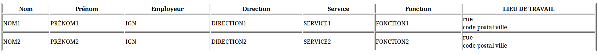

% Initiation à XML
% Véronique Lemaire, Didier Richard
% rèv. 2.1 du 23/10/2015

---


# Découverte d’XML #


## Fiche pédagogique ##

Cours en deux fois 3 heures.

Notes de [cours](XML1-a-slides).


### Objectif ###

* Initiation à XML, sa syntaxe ;
* Initiation à XML Schema et XSL.


### Pré-requis ###

* Notion de programmation ;
* Manipulation d'un éditeur de textes.


### Auteurs ###

© IGN 2009 - Véronique Lemaire - Département Informatique (ENSG)\
© IGN 2015 - Didier Richard - ValiLab (DRE)


---


## XML : un ensemble de langages ##

XML[^xml] signifie e**X**tended **M**arkup **L**anguage : il permet de décrire
dans un format texte (lisible par l'être humain) la structure et le contenu
d’un document (analysable par un logiciel).

_Exemple d’un extrait de fichier XML (mis en page pour être lisible) :_

```xml
<crs>
    <!--RGF93LAMB93 CRS BEGIN-->
    <gml:ProjectedCRS gml:id="RGF93LAMB93">
        <gml:identifier codeSpace="http://registre.ign.fr/ign">
            http://registre.ign.fr/ign/IGNF/crs/IGNF/RGF93LAMB93
        </gml:identifier>
        <gml:name>RGF93 Lambert 93</gml:name>
        <gml:name>http://registre.ign.fr/ign/IGNF/crs/IGNF/IGNF/LAMB93</gml:name>
        <gml:name codeSpace="OGP">urn:ogc:def:crs:EPSG:6.11.2:2154</gml:name>
        <gml:name codeSpace="OGP">urn:ogc:def:crs:EPSG::310024140</gml:name>
        <gml:domainOfValidity>
            <gmd:EX_Extent>
                <gmd:description>
                    <gco:CharacterString>
                        FRANCE METROPOLITAINE (CORSE COMPRISE)
                    </gco:CharacterString>
                </gmd:description>
                <gmd:geographicElement>
                    <gmd:EX_GeographicBoundingBox>
                        <gmd:westBoundLongitude>
                            <gco:Decimal>-5.5</gco:Decimal>
                        </gmd:westBoundLongitude>
                        <gmd:eastBoundLongitude>
                            <gco:Decimal>10</gco:Decimal>
                        </gmd:eastBoundLongitude>
                        <gmd:southBoundLatitude>
                            <gco:Decimal>41</gco:Decimal>
                        </gmd:southBoundLatitude>
                        <gmd:northBoundLatitude>
                            <gco:Decimal>52</gco:Decimal>
                        </gmd:northBoundLatitude>
                    </gmd:EX_GeographicBoundingBox>
                </gmd:geographicElement>
            </gmd:EX_Extent>
        </gml:domainOfValidity>
        <gml:scope>NATIONALE A CARACTERE LEGAL</gml:scope>
        <gml:definedByConversion
            xlink:href="http://registre.ign.fr/ign/IGNF/coordinateOperation/IGNF/PRC014052#PRC014052"/>
        <gml:baseGeographicCRS
            xlink:href="http://registre.ign.fr/ign/IGNF/crs/IGNF/RGF93G#RGF93G"/>
        <gml:usesCartesianCS
            xlink:href="http://registre.ign.fr/ign/IGNF/cs/IGNF/TYP_CRG32#TYP_CRG32"/>
    </gml:ProjectedCRS>
    <!--RGF93LAMB93 CRS END-->
</crs>
```

#### Caractéristiques du XML ####

Il est dérivé de SGML (**S**tandard **G**eneralized **M**arkup **L**anguage)[^sgml]
de façon à être adapté aux nouvelles technologies de la communication (Web).
Il constitue un standard maintenu par le groupement W3C[^w3c] et chapeaute un
ensemble de langages dérivés comme XSD[^xsd], XSL[^xsl] avec XSLT[^xslt] et
XPath[^xpath] ou bien encore SVG[^svg], etc …

À l’inverse d’HTML (**H**yper**T**ext **M**arkup **L**anguage)[^html] qui
offre des possibilités de mise en forme interne (même si dans ce
contexte aussi il est préférable d’utiliser le formalisme CSS à cet effet),
les documents XML ne peuvent pas comporter de mise en forme (police en gras,
couleur, etc …).
La mise en forme est alors assurée par un formalisme dédié : XSL[^xsl].

XSL est décomposé en XSLT[^xslt] (langage de transformation), XPath[^xpath]
(langage de navigation au sein d’un document XML) et XSL-FO[^xsl-fo] (langage
de formatage de la sémantique) et signifie e**X**tensible **S**tylesheet
**L**anguage et permet d’ajouter une mise en forme à tout document textuel.

XML offre la possibilité d’inventer de nouvelles balises ; il est donc ouvert et
extensible (comme son nom l’indique !).
XML est un métalangage en ce sens qu'il permet de créer d'autres langages,
plutôt appelés des vocabulaires.
Cependant des règles encadrent la manière dont on peut créer ces balises en
utilisant une structuration strictement hiérarchique (**notion d'arbre**).

_Exemple du même extrait XML sous forme d'arbre :_


Le contrôle de la structure du document est assuré soit par la DTD
(**D**ocument **T**ype **D**efinition)[^dtd], soit par un XSD.
Si la DTD assure la description de la structure, le XSD permet d’adjoindre à
cette description un contrôle de type[^validator].
Enfin, il a été introduit en 2006 le Schematron[^schematron] qui permet de
décrire des règles de cohérence sur le contenu même des balises et de faire
donc des vérifications plus poussées que celles permises par les XSD.

Du XML a dérivé une nouvelle spécification de HTML, le XHTML[^xhtml] qui
impose au programmeur web de suivre les règles d’encodage du XML ... ce qui
n'a pas été vraiment un moyen pour faire adopter cette recommandation par les
développeurs !

Où trouve-t-on du XML ? ...

_Partout !_

Éditons un document LibreOffice qui contient la chaîne « Test !»
Éditons un document MicrosoftOffice qui contient la même chaîne ...
Ces deux documents sont en fait des archives compressées (`zip`) :

```bash
odt$ unzip test-xml.odt 
Archive:  test-xml.odt
 extracting: mimetype                
 extracting: Thumbnails/thumbnail.png  
  inflating: content.xml             
  inflating: settings.xml            
  inflating: meta.xml                
  inflating: styles.xml              
  inflating: manifest.rdf            
   creating: Configurations2/images/Bitmaps/
   creating: Configurations2/toolpanel/
   creating: Configurations2/progressbar/
  inflating: Configurations2/accelerator/current.xml  
   creating: Configurations2/floater/
   creating: Configurations2/statusbar/
   creating: Configurations2/toolbar/
   creating: Configurations2/popupmenu/
   creating: Configurations2/menubar/
  inflating: META-INF/manifest.xml   
```

et

```bash
docx$ unzip test-xml.docx 
Archive:  test-xml.docx
  inflating: [Content_Types].xml     
  inflating: _rels/.rels             
  inflating: word/_rels/document.xml.rels  
  inflating: word/document.xml       
  inflating: word/theme/theme1.xml   
  inflating: word/settings.xml       
  inflating: word/webSettings.xml    
  inflating: word/stylesWithEffects.xml  
  inflating: docProps/core.xml       
  inflating: word/styles.xml         
  inflating: word/fontTable.xml      
  inflating: docProps/app.xml        
```

En fait, ces documents sont des collections de xml ! Le texte se trouve dans
les fichier `content.xml` et `word/document.xml`.


Enfin autour de nos métiers de géomaticiens, il existe des normes/standards
qui s’appuient sur le formalisme XML :

* KML, **K**eyhole **M**arkup **L**anguage[^kml] ;
* GML, **G**eographic **M**arkup **L**anguage[^gml] ;
* CityGML[^citygml] ;
* XML est aussi une des implémentations choisies pour les métadonnées ISO
  19139[^iso19139] et reprise par INSPIRE[^inspire] ;
* SVG, **S**calable **V**ector **G**raphics[^svg] ;
* etc …


### En résumé ###

On retiendra les points suivants comme caractéristiques importantes du langage à
balises XML :

+--------------------------------------------------+
|Format texte                                      |
+--------------------------------------------------+
|Simplicité et extensibilité                       |
+--------------------------------------------------+
|Structuration forte                               |
+--------------------------------------------------+
|Séparation stricte entre contenu et présentation  |
+--------------------------------------------------+
|Modélisation du contenu (DTD ou XSD)              |
+--------------------------------------------------+


## Les règles d’encodage ##

Un fichier XML est régi par des règles strictes, il doit être :

* bien formé ;
* valide.


### Document bien formé ###

Un document XML **bien formé** doit comporter une structure hiérarchique stricte
et doit se composer de :

* un prologue (_facultatif_) recommandé qui contient toutes les déclarations
    nécessaires à la compréhension du contenu du XML comme `<?xml version="1.0" encoding="UTF-8" standalone="yes" ?>` ;
* un arbre d’éléments correspondant au contenu du document XML et qui doit
    respecter les obligations suivantes :
    * chaque élément se compose d’une balise d’ouverture, d’un contenu et d’une
        balise de fermeture. On utilise aussi le vocable de marqueur pour
        désigner une balise ;
    * un contenu vide peut se noter `<nomBalise />` ;
    * un élément peut porter un ou des attributs `<nomBalise nomAttribut="valeur"> ... </nomBalise>`
      ou `<nomBalise nomAttribut="valeur" />` ;
    * tout élément fils est complètement inclus dans son élément père ;
    * pas de recouvrement entre frères ;
    * dans un document, il n'y a qu'un et un seul élément père. Il contient
        tous les autres éléments (une seule racine) ;
    * des commentaires et des instructions de traitement (facultatifs) comme
        `<!-- mon commentaire -->` ou `<?monInstruction nomContenu ?>`.

#### Règles d'écriture ####

Les espaces dans l'écriture des balises, commentaires et instructions de
traitement sont interdits :

```xml
<? xml version="1.0" encoding="UTF-8" standalone="yes" ?>
```

est une erreur (l'espace entre `?` et `xml`). De même que :

```xml
<  nomBalise> ... </nomBalise>
```

(l'espace entre `<` et `nomBalise`) et que :

```xml
<nomBalise> ... </ nomBalise>
<nomBalise> ... < /nomBalise>
```

De la même façon pour les commentaires :

```xml
<! -- commentaire -->
```

On doit écrire `<!--` et `-->` tout lié !

Par contre, les espaces ailleurs sont non significatifs :

```xml
<nomBalise             nomAttribut    = "valeur">
 ...
</nomBalise>
```

est équivalent à :

```xml
<nomBalise nomAttribut="valeur">
 ...
</nomBalise>
```

À savoir aussi que :

```xml
<nomBalise></nomBalise>
```

et

```xml
<nomBalise/>
```

sont deux écritures équivalentes.

##### Éditeurs #####

Pour faciliter l'écriture (manuelle) de fichiers XML, il peut être bon
d'utiliser des logiciels qui facilitent l'analyse à la volée du XML écrit
(liste largement non exhaustive !) :

* XMLSpy[^xmlspy]
* &lt;oxygen&gt; XML Editor[^oxygen]
* Eclipse IDE
* Kate
* notepad++

#### Le prologue ####

Le début d'un fichier XML peut contenir des informations sur la version XML
utilisée, l'encodage des caractères du fichier XML, ainsi que la structure des
informations que l'on va trouver dans le corps du fichier XML.

##### Version #####

Il convient de définir la version du XML dans l'attribut `version`.
Généralement, on utilise `version="1.0"`, les logiciels en 2015 reconnaissent
cette version, même si la 1.1 existe, mais reste peu supportée !

##### Encodage #####

Il convient de définir son encodage de caractères de façon appropriée dans
l’attribut `encoding`. Il existe de multiples encodages de caractères
disponibles :

* UTF-8 qui code sur une séquence d’octets variables de 1 à 6, il permet de
  coder tous les caractères de l’Universal Character Set (ISO 10646) ;
* ASCII qui code sur 1 caractère (globalement l'anglais !) ;
* ISO-8859-1 correspond au jeu decaractère latin sur 8 bits et permet d’avoir
  nos caractères français spéciaux reconnus.

##### Structure des données #####

Enfin, il est possible de regrouper des balises par catégories en créant des
espaces de noms. Habituellement ces espaces de noms correspondent à un
groupement de balises de contenu ayant un rapport. Par exemple, au sein des
implémentations des normes ISO 191XX, les espaces de noms correspondent à des
groupes de normes qui sont implémentés en XML, `gml` pour la géométrie par
exemple.

Les espaces de noms (namespaces) permettent de regrouper les éléments XML
autour d’un nom unique.
Les éléments appartenant à un espace de noms se distinguent des autres
éléments par l'ajout d'un préfixe symbolisant cette singularité.
Les préfixes d'espace de noms se placent au sein d'un marqueur XML, avant le
nom de l'élément et séparés par le caractère deux-points (:) comme dans :
`<Préfixe:Elément> données </Préfixe:Elément>`

Pour décrire la structure des données, on peut utiliser deux mécanismes :

* la DTD ;
* le schéma XML.


### Document valide ###

Un document valide est un document bien formé qui respecte la structure
définie dans une DTD (Document Definition Type) ou un XSD (XML Schema
Definition).
Dans la suite du paragraphe, nous allons traiter la manière de gérer les DTD.
Nous verrons dans le chapitre suivant comment on utilise les XSD.

#### Document Type Definition (DTD) ####

La DTD permet de décrire précisément le jeu de balises possibles et les
constructions autorisées avec un formalisme proche d’une grammaire.
Il y a quatre possibilités de faire référence à une DTD

1. Une DTD interne

```xml
<?xml version="1.0" encoding="UTF-8" standalone="yes"?>
<!DOCTYPE exemple [
<!ELEMENT exemple (p+)>
<!ELEMENT p (#PCDATA)>
]>
<exemple> 
   <p> ma lettre </p>
   <p> Veuillez agréer, Madame, Monsieur, à l’expression de mes salutations
distinguées </p>
</exemple>
```

2. Une DTD externe

```xml
<?xml version="1.0" encoding="UTF-8" standalone="no"?>
<!DOCTYPE exemple SYSTEM "ex.dtd">
<exemple> 
   <p> ma lettre </p>
   <p> Veuillez agréer, Madame, Monsieur, à l’expression de mes salutations
distinguées </p>
</exemple>
```
On remarquera que l'attribut `standalone` vaut `"no"` dans ce cas.
La DTD vaudra dans notre exemple :

```xml
<!-- début de la DTD -->
<!ELEMENT exemple (p+)>
<!ELEMENT p (#PCDATA)>
<!-- fin de la DTD -->
```

3. Des entités internes (ou jeux de remplacement)

```xml
<?xml version="1.0" encoding="UTF-8" standalone="yes"?>
<!DOCTYPE exemple [
<!-- début de la DTD -->
<!ELEMENT exemple (p+)>
<!ELEMENT p (#PCDATA)>
<!ENTITY formule-politesse "Veuillez agréer, &mme-m; à l’expression de mes
salutations distinguées">
<!ENTITY mme-m "Madame, Monsieur,">
<!-- fin de la DTD -->
<!-- fin du prologue -->
<exemple> 
   <p> ma lettre </p>
   <p> &formule-politesse; </p>
</exemple>
```

On notera que l'on met en fin de prologue les entités ayant une valeur de
remplacement.

Certaines entités sont prédéfinies car utilisées par XML. Ce sont :

+-------------------+------------+
| Caractère spécial | Entité XML |
+===================+============+
| &                 | \&amp;     |
+-------------------+------------+
| <                 | \&lt;      |
+-------------------+------------+
| \>                | \&gt;      |
+-------------------+------------+
| "                 | \&quot;    |
+-------------------+------------+
| '                 | \&aquot;   |
+-------------------+------------+

4. Des entités externes adressées par URL

```xml
<?xml version="1.0" encoding="ISO-8859-1" standalone="no"?>
<!DOCTYPE exemple [
<!-- début de la DTD -->
<!ELEMENT exemple (p+)>
<!ELEMENT p (#PCDATA)>
<!ENTITY entete SYSTEM "part1.xml">
<!ENTITY % formule-politesse-dtd PUBLIC
    "-//W3C//ENTITIES formule"
    "http://serveur-public.net/formule.dtd"
>
&formule-politesse-dtd;
<!ENTITY mme-m "Madame, Monsieur,">
<!-- fin de la DTD -->
<exemple> 
   &entete;
   <p> &formule-politesse; </p>
</exemple>
```

L'entité `entete` est ainsi défini dans un fichier `part1.xml` :

```xml
   <p> ma lettre </p>
```

L'entité `formule-politesse-dtd` qui est accessible via l'URL
`http://serveur-public.net/formule.dtd` est ainsi définie :

```xml
 <!ENTITY formule-politesse "Veuillez agréer, &mme-m; à l’expression de mes
salutations distinguées">
```

Un exemple d'entités externes fort utile est celle contenant des symboles :

```xml
<!ENTITY % HTMLsymbol PUBLIC "-//W3C//ENTITIES Symbols//EN//HTML">
...
%HTMLsymbol;
```

On récupère ainsi des symboles comme \&radic;, \&larr; ...

Il convient à présent de voir quelles sont les manières de traiter
l’arborescence au sein d’une DTD.

##### Élement ou balise #####

Chaque élément (balise) est déclaré dans une balise :

```xml
<!ELEMENT nomDeLaBalise modèle>
```

Chaque élément peut avoir des attributs et des éléments fils ou un contenu
prédéfini.

__Traitement des éléments fils :__

Un élément fils est contenu dans une parenthèse de l’élément père.
S’ils ont un ordre imposé, ils sont séparés par une virgule, sinon par la
barre verticale.
Quand l’élément n’est suivi d’aucune indication il doit apparaître une fois et
une seule. S’il est suivi d’un point d’interrogation `?`, il apparait 0 ou une
fois. S’il est suivi d’une `*` il apparait de 0 à n fois et enfin s’il est suivi
d’un `+` il apparait au moins une fois.

```xml
<!ELEMENT texte (strophe+)>
<!ELEMENT poeme (titre,auteur,texte)>
<!ELEMENT file_attente (homme|femme)*>
```

##### Éléments de données ou mixtes #####

Un élément peut contenir des données textuelles indiquées par la valeur
`#PCDATA` (Parsed Character Data) ou un modèle mixte comme suit :

```xml
<!ELEMENT p (#PCDATA)>
<!ELEMENT p (#PCDATA|note)*>
```

On peut indiquer quelles balises contiennent n’importe quel contenu ou sont
vides comme suit :

```xml
<!ELEMENT nimporteQuoi ANY>
<!ELEMENT vide EMPTY>
```

##### Traitements des attributs #####

Les éléments peuvent être précisés par des attributs selon la syntaxe
suivante :

```xml
<!ATTLIST nomElement
   nomAtribut1 typeAttribut1 valeurAttribut1
   nomAtribut2 typeAttribut2 valeurAttribut2
   nomAtribut3 typeAttribut3 valeurAttribut3
>
```

Les types d’attributs sont :

* `CDATA`, c'est une chaîne de caractères littérale ;
* `ID` ou `IDREF` ou `IDREFS` sont respectivement l’identifiant de
  l’élément (au sens lien web), l’identifiant d’un élément référencé (ailleurs
  dans le document) ou une liste d’identifiants d’éléments référencés ;
* `ENTITY` et `ENTITIES` renvoie sur le nom d’une ou plusieurs entitées ;
* `NOTATION` renvoie sur le nom d'une entités non XML (une image, un son, etc
   ...) ;
* `NMTOKEN` ou `NMTOKENS` contient un ou des identifiants (au sens base de
  données) ;
* une liste de valeurs possibles séparées par des `|`

Les déclarations d'attributs peuvent être :

* obligatoire avec le mot-clé `#REQUIRED` ;
* non obligatoire et pouvant rester vide `#IMPLIED` ;
* avec une valeur par défaut directement déclarée ;
* avec une valeur constante via `#FIXED "valeur_de_la_constante"`;

## Les espaces de noms ##

La nécessité de réutiliser des langages XML dans d'autres languages XML a
conduit au concept d'espaces de noms. Ces espaces permettent d'identifier le
langage d'origine (ou vocabulaire) et de les utiliser dans un nouveau langage.

Le mélange de plusieurs espaces de noms au sein d'un même document ne doit pas
empêcher la validation de celui-ci... Ils doivent rester valides.
Les espaces de noms permettant d'identifier la source du langage utiliser pour
chaque élément ou attribut assurent justement ce rôle.

Chaque élément ou attribut appartient à un espace de noms qui détermine le
vocabulaire dont il est issu. Cette appartenance est marquée par la présence
dans le nom d'un préfixe associé à l'espace de noms et séparé du nom par le
caractère `:`.

_Exemple avec des espaces de noms multiples :_

```xml
<crs>
    <!--RGF93LAMB93 CRS BEGIN-->
    <gml:ProjectedCRS gml:id="RGF93LAMB93">
        <gml:identifier codeSpace="http://registre.ign.fr/ign">
            http://registre.ign.fr/ign/IGNF/crs/IGNF/RGF93LAMB93
        </gml:identifier>
        <gml:name>RGF93 Lambert 93</gml:name>
        <gml:name>http://registre.ign.fr/ign/IGNF/crs/IGNF/IGNF/LAMB93</gml:name>
        <gml:name codeSpace="OGP">urn:ogc:def:crs:EPSG:6.11.2:2154</gml:name>
        <gml:name codeSpace="OGP">urn:ogc:def:crs:EPSG::310024140</gml:name>
        <gml:domainOfValidity>
            <gmd:EX_Extent>
                <gmd:description>
                    <gco:CharacterString>
                        FRANCE METROPOLITAINE (CORSE COMPRISE)
                    </gco:CharacterString>
                </gmd:description>
                <gmd:geographicElement>
                    <gmd:EX_GeographicBoundingBox>
                        <gmd:westBoundLongitude>
                            <gco:Decimal>-5.5</gco:Decimal>
                        </gmd:westBoundLongitude>
                        <gmd:eastBoundLongitude>
                            <gco:Decimal>10</gco:Decimal>
                        </gmd:eastBoundLongitude>
                        <gmd:southBoundLatitude>
                            <gco:Decimal>41</gco:Decimal>
                        </gmd:southBoundLatitude>
                        <gmd:northBoundLatitude>
                            <gco:Decimal>52</gco:Decimal>
                        </gmd:northBoundLatitude>
                    </gmd:EX_GeographicBoundingBox>
                </gmd:geographicElement>
            </gmd:EX_Extent>
        </gml:domainOfValidity>
        <gml:scope>NATIONALE A CARACTERE LEGAL</gml:scope>
        <gml:definedByConversion
            xlink:href="http://registre.ign.fr/ign/IGNF/coordinateOperation/IGNF/PRC014052#PRC014052"/>
        <gml:baseGeographicCRS
            xlink:href="http://registre.ign.fr/ign/IGNF/crs/IGNF/RGF93G#RGF93G"/>
        <gml:usesCartesianCS
            xlink:href="http://registre.ign.fr/ign/IGNF/cs/IGNF/TYP_CRG32#TYP_CRG32"/>
    </gml:ProjectedCRS>
    <!--RGF93LAMB93 CRS END-->
</crs>
```

Dans cet exemple, on trouve les espaces de noms `gml`, `gmd`, `gco` et ...
`xlink` et un espace qui n'a pas de nom (pour la balise `crs`) ! Ce dernier
est appelé espace de noms par défaut.

Un espace de noms est identifié par un URI appelé URI de l'espace de noms. Cet
URI est très souvent une URL mais il est sans importance que l'URL pointe
réellement sur un document. Cet URI garantit seulement que l'espace de noms
soit identifié de manière unique. 

### Déclaration d'un espace de noms ###

L'obligation de qualifier chaque élément ou attribut dans une DTD impose donc
de déclarer l'espace de noms :

```xml
<!ELEMENT prefixe:balise modèle>
<!ATTLIST prefixe:balise xmlns:prefixe CDATA (#REQUIRED| #IMPLIED | #FIXED "URI")>
<!ATTLIST prefixe:balise xmlns:prefixeAttribut CDATA (#REQUIRED| #IMPLIED | #FIXED "URI2")> 
<!ATTLIST prefixe:balise prefixeAttribut:nom CDATA>
```

### Espaces de noms prédéfinis et classiques ###

`xml` est toujours implicitement lié à l'espace de noms XML identifié par
l'URI http://www.w3.org/XML/1998/namespace. Cet espace de noms n'a pas besoin
d'être déclaré. Les quatre attributs particuliers `xml:lang`, `xml:space`,
`xml:base` et `xml:id` font partie de cet espace de noms.

+----------------------+-----------------+-------------------------------------------+
| Espace de noms       | Préfixes usuels | URI                                       |
+======================+=================+===========================================+
| XInclude             | xi              | http://www.w3.org/2001/XInclude           |
+----------------------+-----------------+-------------------------------------------+
| XLink                | xlink           | http://www.w3.org/1999/xlink              |
+----------------------+-----------------+-------------------------------------------+
| XHTML                | xhtml           | http://www.w3.org/1999/xhtml              |
+----------------------+-----------------+-------------------------------------------+
| SVG                  | svg             | http://www.w3.org/2000/svg                |
+----------------------+-----------------+-------------------------------------------+
| XSD                  | xs, xsd         | http://www.w3.org/2001/XMLSchema          |
+----------------------+-----------------+-------------------------------------------+
| Instances de schémas | xsi             | http://www.w3.org/2001/XMLSchema-instance |
+----------------------+-----------------+-------------------------------------------+
| XSLT                 | xsl             | http://www.w3.org/1999/XSL/Transform      |
+----------------------+-----------------+-------------------------------------------+
| Dublin Core          | dc              | http://purl.org/dc/elements/1.1/          |
+----------------------+-----------------+-------------------------------------------+

## Asynchronous JavaScript And XML (AJAX) ##

AJAX (*A*synchronous *J*avascript *A*nd *X*ML) permet de construire des
applications Web et des sites web dynamiques interactifs sur le poste client
en se servant de différentes technologies

Dans une application Web, la méthode classique de dialogue entre un navigateur
et un serveur est la suivante : lors de chaque manipulation faite par
l'utilisateur, le navigateur envoie une requête contenant une référence à une
page Web, puis le serveur Web effectue des calculs, et envoie le résultat sous
forme d'une page Web à destination du navigateur. Celui-ci affichera alors la
page qu'il vient de recevoir. Chaque manipulation entraîne la transmission et
l'affichage d'une nouvelle page. L'utilisateur doit attendre l'arrivée de la
réponse pour effectuer d'autres manipulations.

En utilisant AJAX, le dialogue entre le navigateur et le serveur se déroule la
plupart du temps de la manière suivante : un programme écrit en langage de
programmation JavaScript, incorporé dans une page web, est exécuté par le
navigateur. Celui-ci envoie en arrière-plan des demandes au serveur Web, puis
modifie le contenu de la page actuellement affichée par le navigateur Web en
fonction du résultat reçu du serveur, évitant ainsi la transmission et
l'affichage d'une nouvelle page complète.

En AJAX, comme le nom l'indique, les demandes sont effectuées de manière
asynchrone : le navigateur Web continue d'exécuter le programme JavaScript
alors que la demande est partie, il n'attend pas la réponse envoyée par le
serveur Web et l'utilisateur peut continuer à effectuer des manipulations
pendant ce temps.

AJAX combine plusieurs technologies :

* JavaScript est un langage de programmation incorporé dans les navigateurs.
Les programmes écrits dans ce langage sont exécutés par le navigateur. Il est
utilisé en particulier pour exploiter le XMLHttpRequest et le DOM. C'est la
clé de voûte de l'AJAX ;

* Le *XMLHttpRequest* est un objet de programmation, utilisé dans les programmes
en langage JavaScript pour assurer la communication entre le navigateur et un
serveur Web. Il est utilisé pour la communication asynchrone : envoyer les
requêtes vers le serveur et déclencher des opérations lors de la réception de
réponses de celui-ci ;

* XML est un langage de balisage et JSON (*J*ava*S*cript *O*bject *N*otation)
est un format de données inspirée de la syntaxe du langage JavaScript. Ils
sont utilisés pour structurer les informations envoyées par le serveur Web.
Le format XML peut être accompagné de XSLT pour sa manipulation ;

* Le DOM (*D*ocument *O*bject *M*odel) pour l'affichage dynamique et
l'interaction avec les données. C'est une collection d'objets où chaque objet
représente un élément structurel ou visuel d'une page web ou d'un document
XML. Il est utilisé à partir d'un langage de programmation orientée objet tel
que JavaScript pour inspecter et modifier le contenu des pages Web.

## Exemple ##

Saisie de deux nombres, calcul de leur somme et affichage du résultat.

* index.html :

```html
<!DOCTYPE html>
<html lang="fr">
  <head>
    <meta charset="UTF-8">
    <title></title>
    <link rel="stylesheet" media="screen" href="style.css">
    <!-- Les sources de la bibliothèque JQuery -->
    <script src="http://code.jquery.com/jquery.min.js"></script>
    <!-- La source qui contient le code d'envoi en Ajax -->
    <script src="script.js"></script>
  </head>
  <body>
    <form method="post" action="add.php"> <!-- Formulaire envoyé par la méthode POST -->
      <fieldset>
    <legend>Choisissez deux nombres entiers</legend>
    <!-- Premier nombre -->
    <p><label>a = <input name="a" type="number" required></label></p>
    <!-- Deuxième nombre -->
    <p><label>b = <input name="b" type="number" required></label></p>
      </fieldset>
      <fieldset>
    <legend>R&eacute;sultat</legend>
    <p id="result"></p> <!-- Le résultat sera placé ici -->
      </fieldset>
      <p><button>Soumettre</button></p> <!-- Bouton de soumission -->
    </form>
  </body>
</html>
```

*  script.js :

```javascript
// Abonne le callback à exécuter lorsque tout le DOM est chargé
$(document).ready(OnReady);
function OnReady(){
    // Abonne un callback à l'évènement "submit" du formulaire
    $("form").submit(OnSubmit);
}
function OnSubmit(){
    $.ajax({
        // Récupère la méthode d'envoi du formulaire, ici "POST"
        type: $(this).attr("method"),
        // Récupère l'url du script qui reçoit la requête, ici "add.php"
        url: $(this).attr("action"),
        // Fabrique la "query string" contenant les deux nombres
        data: $(this).serialize(),
        // Callback qui récupère la réponse du serveur
        success: OnSuccess
    });
    // Annule l'envoi classique du formulaire
    return false;
}
function OnSuccess(result){
    // Insère le résultat dans la balise d'id "result"
    $("#result").html(result);
}
```

* add.php (côté serveur) :

```php
<?php
$a = filter_input(INPUT_POST, "a", FILTER_VALIDATE_INT);
$b = filter_input(INPUT_POST, "b", FILTER_VALIDATE_INT);
echo $a + $b;   // Envoie au client le résultat du calcul de a + b
```

_Source :_ &copy; Wikipédia

## Schémas XML (XSD) ##

Cette partie est beaucoup plus complexe que les précédentes. Le lecteur doit
avoir quelques connaissances en programmation ...

### Pourquoi un modèle ? ###

La syntaxe des DTD est issue du langage SGML (*S*tandard *G*eneralized
*M*arkup *L*anguage), beaucoup plus compliqué et lourd que ne l'est le langage
XML.

Le XML langage universel doit permettre un ensemble cohérent d’applications
depuis la définition des modèles jusqu’à leur présentation en passant par leur
structuration … Pour des soucis d’homogénéité, il fallait développer un langage
de définition de documents basé sur XML.

La définition de schémas XML (*X*ML *S*chema *D*efinition en anglais ou XSD)
apporte une grande souplesse et une puissance inégalée dans la définition des
documents XML. La fonctionnalité la plus remarquable des schémas XML est la
prise en charge des types de données (contenu garanti et validation plus
efficace). Le XSD permet aussi un modèle plus exhaustif car définissant les
éléments et la structure, avec les occurrences, les contenus mixtes, les
groupes d’attributs …

Enfin, l'extensibilité des définitions des documents apportée par les schémas
XML, facilite l'échange, la fusion ou la réutilisation de données provenant
d'une ou plusieurs sources. Effectivement, à l'instar des documents XML, les
schémas XML pourront désormais se combiner en se fusionnant complètement ou
partiellement afin de créer un modèle de contenu composite. D'ailleurs,
plusieurs schémas peuvent être référencés à l'intérieur d'un unique document
XML et donc valider la structure et le contenu de ce dernier.

La génération dynamique de documents XML et du modèle de contenu associé,
devient alors beaucoup plus commode. Évidemment, cela demande une certaine
compatibilité entre les schémas susceptibles d'être combinés en passant par
une normalisation entre distributeurs des contenus ou en utilisant des XSD
« standards ».

Ce langage de schéma constitue donc une pièce essentielle dans la sphère XML,
assurant une évolutivité, un dynamisme et une souplesse que ne pouvait assumer
le langage de DTD.

### Généralités ###

Le schéma commence par un élément racine, `xsd:schema` est la racine de tout
XSD, il est caractérisé par des attributs qu’il faut renseigner :

* `attributeFormDefault` : permet de savoir si les attributs doivent être munis de
  l’espace de noms ou pas ;
* `blockDefault` : empêche par défaut l’utilisation de types dérivés dans des
éléments attendant un type de base- extension restriction substitution-;
* `elementFormDefault` : permet de savoir si les éléments doivent être munis de
l’espace de noms ou pas ;
* `finalDefault` empêche la dérivation de type par restriction, extension ou les
deux ;
* `id` précise un identificateur unique pour le schéma ;
* `targetNamespace` indique un namespace cible pour tout élément étranger au
schéma XML ;
* `version` indique un numéro de version du schéma ;
* `xml:lang` précise la langue dans laquelle est conçu le document.

Et bien sûr on peut définir la liste de namespaces utilisés avec `xmlns`.
Le préfixe de l'espace de noms des schémas est très souvent `xsd` ; la forme
`xs` est aussi utilisée :

```xml
<?xml version="1.0" encoding="utf-8"?>
<xsd:schema xmlns:monEN="http://www.ensg.eu/xml1-a"
            xmlns:xsd="http://www.w3.org/2001/XMLSchema"
            targetNamespace="http://www.ensg.eu/xml1-a"
            elementFormDefault="qualified"
            version="0.0.1">
...
</xsd:schema>
```

L'élément `include` permet d'inclure un schéma XML d'un même espace de noms dans
un autre schéma pour l'utiliser :

```xml
<xsd:include id="ID" schemaLocation="anyURI"
             {tout attribut ayant un espace de noms différent de celui du schéma...}/>
```

L'élément `import` permet d'importer un schéma XML avec un espace de noms
différent dans un autre schéma pour l'utiliser :

```xml
<xsd:import id="ID" namespace="anyURI" schemaLocation="anyURI"
            {tout attribut ayant un espace de noms différent de celui du schéma...}/>
```

L’élément `xsd:element` permet de définir un élément du document XML et d’y
associer des propriétés. Si on a un type simple (i.e. atomique et sans
attributs), la définition se fait simplement, si on souhaite un type simple
personnalisé on utilise la balise `<xsd:simpleType>` et si on souhaite un type
complexe on utlise la balise `<xsd:complexType>` et enfin si on veut un
groupe, on utilise la balise `<xsd:group>` !


Les attributs associés à `xsd:element` sont répertoriés dans le tableau suivant :

+------------------+-----------------------------------------------+
|Attributs         |Description                                    |
+==================+===============================================+
|abstract          |provoque l'abstraction (true) de l'élément XML,|
|                  |devant être remplacé par un autre élément      |
+------------------+-----------------------------------------------+
|block             |spécifie une valeur de blocage du type dans des|
|                  |éléments attendant le type de base             |
+------------------+-----------------------------------------------+
|default           |précise une valeur par défaut pour l'élément   |
+------------------+-----------------------------------------------+
|final             |empêche la dérivation de type par restriction, |
|                  |extension ou les deux                          |
+------------------+-----------------------------------------------+
|fixed             |empêche une dérivation par restriction du type |
|                  |de l'élément                                   |
+------------------+-----------------------------------------------+
|form              |indique si l'élément XML doit être ou non      |
|                  |qualifié par un espace de noms                 |
+------------------+-----------------------------------------------+
|id                |précise un identificateur unique pour l'élément|
+------------------+-----------------------------------------------+
|maxOccurs         |précise le nombre d'occurrences maximum de     |
|                  |l'élément. Par défaut, ce nombre est égal à 1  |
+------------------+-----------------------------------------------+
|minOccurs         |précise le nombre d'occurrences minimum de     |
|                  |l'élément. Par défaut, ce nombre est égal à 1  |
+------------------+-----------------------------------------------+
|name              |indique le nom de l'élément XML                |
+------------------+-----------------------------------------------+
|nillable          |signifie qu'un élément peut être valide (true) |
|                  |lorsqu'il est nul, s'il est porteur d'un       |
|                  |attribut qualifié d'espace de noms `xsd:nil`   |
+------------------+-----------------------------------------------+
|ref               |spécifie une référence à un autre élément de   |
|                  |schéma                                         |
+------------------+-----------------------------------------------+
|substitutionGroup |définit un élément pour lequel l'élément peut  |
|                  |se substituer                                  |
+------------------+-----------------------------------------------+
|type              |fournit le type de données accepté par         |
|                  |l'élément                                      |
+------------------+-----------------------------------------------+

#### Les types simples ####

Un type simple est une balise XML qui ne contient que du texte, donc pas
d’attribut. La notion « que du texte » est trompeuse dans le sens où ce texte
peut prendre plusieurs formes et recouvrir plusieurs types au sens
informatique du terme.

Il en existe une liste assez longue d’une quarantaine de possibilités parmi
lesquelles on pourra retenir `xsd:string`, `xsd:integer`, `xsd:decimal`,
`xsd:time`, `xsd:boolean`, `xsd:date` …

On peut donc couvrir la majorité des cas qu’on rencontrera pour les types
simples.

Il est également possible de dériver des types simples :

* en les restreignant ;
* en définissant un format à adopter ;
* en créant une énumération ;
* en créant une liste d’éléments d’un type donné.

##### La restriction de type simple #####

```xml
<xsd:simpleType name="monEntier">
    <xsd:restriction base="xsd:integer">
        <xsd:minInclusive value="10000"/>
        <xsd:maxInclusive value="99999"/>
    </xsd:restriction>
</xsd:simpleType>

<xsd:element name="entier" type="monEntier"/>
```

donnera par exemple :

```xml
<entier>10001</entier
```

##### Définition d’un format #####

```xml
<xsd:simpleType name="monFormat">
    <xsd:restriction base="xsd:string">
        <xsd:pattern value="\d{3}-[A-Z]{2}"/>
    </xsd:restriction>
</xsd:simpleType>

<xsd:element name="format" type="monFormat"/>
```

donnera par exemple :

```xml
<format>123-AA</format>
```

##### Enumération #####

```xml
<xsd:simpleType name="unDepartement">
    <xsd:restriction base="xsd:string">
        <xsd:enumeration value="Ain"/>
        <xsd:enumeration value="Aisne"/>
        <xsd:enumeration value="Allier"/>
        <!-– etc -->
    </xsd:restriction>
</xsd:simpleType>

<xsd:element name="departement" type="unDepartement"/>
```

donnera par exemple :

```xml
<departement>Seine-et-Marne</departement>
```

##### Liste #####

```xml
<xsd:simpleType name="listeDEntiers">
    <xsd:list itemType="monEntier"/>
</xsd:simpleType>

<xsd:element name="liste" type="listeDEntiers"/>
```

donnera par exemple :

```xml
<liste>10000 20001 99999</liste>
```

#### Les types complexes ####

Les types complexes sont définis de différentes manières :

* par une extension d’un type simple auquel on adjoint un attribut ;
* par une séquence, un choix ou une suite d’éléments simples ;
* par un groupe.

On peut les dériver à partir des types simples en y ajoutant simplement un
attribut par exemple de la manière suivante :

```xml
<xsd:complexType name="unPrix">
    <xsd:simpleContent>
        <xsd:extension base="xsd:decimal">
            <xsd:attribute name="monnaie" type="xsd:string"/>
        </xsd:extension>
    </xsd:simpleContent>
</xsd:complexType>

<xsd:element name="prix" type="unPrix"/>
```

donnera par exemple :

```xml
<prix monnaie="euro">42.0</prix>
```

On peut décider de réaliser une séquence d’éléments de types définis. Dans
l’exemple suivant, on voit comment faire référence à un élément
défini par ailleurs dans le XSD et comment on définit les attributs (déjà vu dans
l’exemple précédent) :

```xml
<xsd:element name="element_1" type="xsd:integer"/>
<xsd:element name="element_2" type="xsd:integer"/>
<xsd:element name="element_3" type="xsd:integer"/>
<xsd:complexType name="element_enfantType">
    <xsd:sequence>
        <xsd:element ref="element_1"/>
        <xsd:element ref="element_2"/>
        <xsd:element ref="element_3"/>
    </xsd:sequence>
    <xsd:attribute name="id" use="required">
        <xsd:simpleType>
            <xsd:restriction base="xsd:NMTOKEN">
                <xsd:enumeration value="01"/>
                <xsd:enumeration value="02"/>
            </xsd:restriction>
        </xsd:simpleType>
    </xsd:attribute>
</xsd:complexType>

<xsd:element name="entiers" type="element_enfantType"/>
```

donnera par exemple :

```xml
<entiers id="01">
    <element_1>42</element_1>
    <element_2>99</element_2>
    <element_3>0</element_3>
</entiers>
```

On peut indiquer qu’un élément prend au choix une structure ou une autre comme
dans l’exemple suivant :

```xml
<xsd:element name="element_choix_1" type="xsd:integer"/>
<xsd:element name="element_choix_2" type="xsd:integer"/>
<xsd:complexType name="element_enfantType">
    <xsd:choice> 
        <xsd:element ref="element_choix_1"/>
        <xsd:element ref="element_choix_2"/>
    </xsd:choice>
    <xsd:attribute name="id" use="required">
        <xsd:simpleType>
            <xsd:restriction base="xsd:NMTOKEN">
                <xsd:enumeration value="01"/>
                <xsd:enumeration value="02"/>
               </xsd:restriction>
         </xsd:simpleType>
    </xsd:attribute>
</xsd:complexType>

<xsd:element name="entiers" type="element_enfantType"/>
```

donnera par exemple :

```xml
<entiers id="01">
    <element_choix_1>42</element_choix_1>
</entiers>
<entiers id="02">
    <element_choix_2>99</element_choix_2>
</entiers>
```

On peut enfin décrire une suite d’éléments simples sans ordre obligatoire :

```xml
<xsd:complexType name="element_enfantType">
    <xsd:all minOccurs="0" maxOccurs="1">
        <xsd:element name="element_1" type="xsd:integer"/>
        <xsd:element name="element_2" type="xsd:integer"/>
        <xsd:element name="element_3" type="xsd:integer"/>
    </xsd:all>
    <xsd:attribute name="id" use="required">
        <xsd:simpleType>
            <xsd:restriction base="xsd:NMTOKEN">
                <xsd:enumeration value="01"/>
                <xsd:enumeration value="02"/>
               </xsd:restriction>
         </xsd:simpleType>
    </xsd:attribute>
</xsd:complexType>

<xsd:element name="entiers" type="element_enfantType"/>
```

donnera par exemple :

```xml
<entiers id="01">
    <element_2>99</element_2>
    <element_3>0</element_3>
</entiers>
<entiers id="02"/>
```

Enfin on peut définir via la balise `complexContent`, un type plus complexe
encore :

```xml
<xsd:complexType name="type_personne" block="restriction">
    <xsd:sequence>
        <xsd:element name="nom" type="xsd:string"/>
        <xsd:element name="prenom" type="xsd:string"/>
        <xsd:element name="adresse" type="xsd:string"/>
    </xsd:sequence>
</xsd:complexType>
<xsd:complexType name="type_francaise">
    <xsd:complexContent>
        <xsd:extension base="type_personne">
            <xsd:sequence>
                <xsd:element name="code_postal" type="xsd:positiveInteger"/>
                <xsd:element name="ville" type="xsd:string"/>
            </xsd:sequence>
        </xsd:extension>
    </xsd:complexContent>
</xsd:complexType>

<xsd:element name="personne" type="type_francaise"/>
```

donnera par exemple :

```xml
<personne>
    <nom>NOM</nom>
    <prenom>PRENOM</prenom>
    <adresse>ADRESSE</adresse>
    <code_postal>1</code_postal>
    <ville>VILLE</ville>
</personne>
```

## XSL : la feuille de style du XML ##

Tout comme par XSD, cette partie du cours est encore plus complexe !

### Généralités ###


Le langage XSL est à XML ce que CSS est à HTML dans une première approche: il
permet d’effectuer une visualisation du contenu décrit dans un fichier XML.

Le langage XSL se divise en deux parties principales :

* Le formatage : application de règles de style sur des éléments XML à l'instar
  du langage CSS ;
* La transformation : substitution d'un marquage XML en un balisage HTML ou un
  autre marquage XML. 

La partie formatage du langage XSL (e*X*tensible *S*tylesheet *L*anguage) a une
fonction semblable à celle du langage CSS (*C*ascading *S*tyle*S*heet).

Le langage XSL, par une série de règles de transformation, remplace les
éléments XML et leurs attributs en balisage HTML (*H*yper*T*ext *M*arkup *L*anguage)
ou en d'autres marqueurs XML. Cette section du langage XSL s'appelle XSLT soit
Langage des feuilles de Style de Transformation dont les spécifications sont
mises au point par le W3C (World Wide Web Consortium). 

Cela s’applique de cette manière par exemple sur un document XML qui
contiendrait cet ordre :

```xml
<?xml-stylesheet type="text/xsl" href="style.xsl"?>
```

On peut appliquer du XSL de trois manières :

1. La première solution demande à l'ordinateur client de posséder impérativement
  un navigateur compatible avec les technologies (tous désormais) ;
2. La seconde solution demande un aménagement logiciel du serveur web avec par
   exemple, un programme XML Enabler d'IBM, afin de le rendre compatible aux
   technologies XML/XSL ;
3. Enfin, la dernière solution consiste à installer un moteur de transformation
   XML nommé XT (XML Transformer) associé à un analyseur (ou parser) conforme à
   SAX (Simple API for XML) ou DOM (Document Object Model).

De nombreux programmes permettent de mettre à niveau son serveur :

* JAXP édité par Sun Microsystems ; 
* Xalan &amp; Xerces édités par l'Organisation Apache ;
* XP &amp; XT édités par l'auteur des spécifications XSL, James Clark ; 
* MSXML 4.0 édité par Microsoft ; 
* XML Parser édité par IBM.

L’entête d’un fichier XSL se compose :

* De l’entête d’un fichier XML (puisqu’un fichier XSL est un fichier XML) ;
* Des espaces de noms correspondant
* Du document de sortie.

```xml
<?xml version="1.0" encoding="UTF-8"?>
<xsl:stylesheet
    xmlns:xsl="http://www.w3.org/1999/XSL/Transform"
    version="1.0"
>
<xsl:output method="html" encoding="UTF-8"/>
...
</xsl:stylesheet>
```

Les espaces de noms associés à XSL sont :

* pour XSLT : http://www.w3.org/1999/XSL/Transform ; 
* pour XSL-FO : http://www.w3.org/1999/XSL/Format/1.0 (formatage du XML)

### Les motifs (patterns) ###

Les patterns sont les expressions utilisées pour sélectionner les nœuds d’un
document XML et on les utilise dans les attributs `select` ou `match` des éléments
du XSLT. Le tableau ci-après permet de présenter les motifs possibles ainsi
que ce qu’ils représentent. Ils viennent en complément du langage XPATH que
nous étudierons dans le paragraphe suivant.

+-------------------------+------------------------------------------------------+
| Motifs                  | Description                                          |
+=========================+======================================================+
| x                       | n'importe quel élément de nom x, fils de l'élément   |
|                         | courant                                              |
+-------------------------+------------------------------------------------------+
| \*/x                    | n'importe quel élément de nom x, petit-fils de       |
|                         | l'élément courant                                    |
+-------------------------+------------------------------------------------------+
| x|y                     | n'importe quel élément de nom x ou y, fils de        |
|                         | l'élément courant                                    |
+-------------------------+------------------------------------------------------+
| x/y                     | n'importe quel élément de nom y, fils d'un élément   |
|                         | x lui-même fils de l'élément courant                 |
+-------------------------+------------------------------------------------------+
| x//y                    | n'importe quel élément de nom y, descendant d'un     |
|                         | élément x lui-même fils de l'élément courant         |
+-------------------------+------------------------------------------------------+
| /                       | le nœud racine du fichier XML                        |
+-------------------------+------------------------------------------------------+
| ./                      | n'importe quel fils de l'élément courant             |
+-------------------------+------------------------------------------------------+
| ../x                    | n'importe quel élément de nom x, père de l'élément   |
|                         | courant                                              |
+-------------------------+------------------------------------------------------+
| id("n")                 | l'élément d'identifiant XML "n"                      |
+-------------------------+------------------------------------------------------+
| x[1]                    | le premier élément de nom x, fils de l'élément       |
|                         | courant                                              |
+-------------------------+------------------------------------------------------+
| x[last()=1]             | le dernier élément de nom x, fils de l'élément       |
|                         | courant                                              |
+-------------------------+------------------------------------------------------+
| x/y[position()>1]       | tout élément de nom y, fils de l'élément x fils de   |
|                         | l'élément courant, sauf le premier fils de x         |
+-------------------------+------------------------------------------------------+
| x[position() mod 2 = 1] | tout élément de nom x, fils de rang impair de        |
|                         | l'élément courant                                    |
+-------------------------+------------------------------------------------------+
| x[@a="v"]//y            | tout élément de nom y, descendant d'un élément de    |
|                         | nom x pour lequel l'attribut a vaut "v", x est fils  |
|                         | de l'élément courant                                 |
+-------------------------+------------------------------------------------------+
| x/@a                    | tous les attributs a des éléments de nom x, fils de  |
|                         | l'élément courant                                    |
+-------------------------+------------------------------------------------------+
| @*                      | tous les attributs de l'élément courant et de ses    |
|                         | descendants                                          |
+-------------------------+------------------------------------------------------+


### Le langage XPath ###

On utilise les patterns pour pouvoir sélectionner les nœuds et on applique 
Un axe nodal ouvre des « directions de recherche » indiquées par le préfixe
avant les patterns et les deux points
Un prédicat est une expression entre crochets permettant de cibler au mieux
une partie de l’arborescence XML
Une fonction nodale peut être booléenne, calculatoire,…

Le tableau suivant récapitule les principaux axes nodaux écrits de manière
complète :

+---------------------+-----------------------------------------------+
|Axe nodal            |Description                                    |
+=====================+===============================================+
|ancestor::           |représente les nœuds parents du nœud courant   |
|                     |jusqu'au nœud racine                           |
+---------------------+-----------------------------------------------+
|ancestor-or-self::   |représente le nœud lui-même avec les mêmes     |
|                     |caractèristiques que ancestor::                |
+---------------------+-----------------------------------------------+
|descendant::         |représente les nœuds fils du nœud courant      |
|                     |jusqu'au nœud terminal                         |
+---------------------+-----------------------------------------------+
|descendant-or-self:: |représente le nœud lui-même avec les mêmes     |
|                     |caractèristiques que descendant                |
+---------------------+-----------------------------------------------+
|self::               |représente le nœud lui-même                    |
+---------------------+-----------------------------------------------+
|parent::             |représente les nœuds parents directs           |
+---------------------+-----------------------------------------------+
|child::              |représente les nœuds fils directs              |
+---------------------+-----------------------------------------------+
|attribute::          |représente les nœuds attributs du nœud         |
|                     |courant                                        |
+---------------------+-----------------------------------------------+
|following::          |représente tous les nœuds suivant le nœud      |
|                     |courant hormis les nœuds attributs et espaces  |
|                     |de noms                                        |
+---------------------+-----------------------------------------------+
|following-sibling::  |représente la même chose que following mais    |
|                     |essentiellement les nœuds qui ont le même      |
|                     |parent que le nœud courant                     |
+---------------------+-----------------------------------------------+
|preceding::          |représente tous les nœuds précédant le nœud    |
|                     |courant hormis les nœuds attributs et espaces  |
|                     |de noms                                        |
+---------------------+-----------------------------------------------+
|preceding-sibling::  |représente la même chose que preceding mais    |
|                     |essentiellement les nœuds qui ont le même      |
|                     |parent que le nœud courant                     |
+---------------------+-----------------------------------------------+

Il existe une façon abrégée de présenter les axes nodaux et qui correspondent
à des représentations des axes nodaux présentés ci-dessus avec des symboles
simplificateurs.

Le tableau ci-dessous présente tous les nœuds abrégés qui existent :

+-----------+----------------------------------------------------+
|Opérateur  | Description                                        |
+===========+====================================================+
|element    |sélectionne tous les éléments element fils du nœud  |
|           |courant (child::element)                            |
+-----------+----------------------------------------------------+
|\*         |sélectionne tous les éléments fils du nœud courant  |
+-----------+----------------------------------------------------+
|/          |représente l'élément racine                         |
+-----------+----------------------------------------------------+
|//         |représente n'importe quel descendant de l'élément   |
|           |racine, donc tous les éléments                      |
|           |(descendant-or-self::node())                        |
+-----------+----------------------------------------------------+
|.          |représente l'élément courant (self::node())         |
+-----------+----------------------------------------------------+
|..         |permet de remonter d'un niveau dans l'arborescence  |
|           |du document par rapport à l'élément courant         |
|           |(parent::node())                                    |
+-----------+----------------------------------------------------+
|/element   |sélectionne tous les éléments element sous l'élément|
|           |racine ()                                           |
+-----------+----------------------------------------------------+
|./element  |sélectionne tous les éléments element sous l'élément|
|           |courant (following::element)                        |
+-----------+----------------------------------------------------+
|../element |sélectionne tous les éléments element sous l'élément|
|           |parent du nœud courant (preceding::element)         |
+-----------+----------------------------------------------------+
|//element  |sélectionne tous les éléments element descendants du|
|           |nœud courant à quelque niveau de profondeur que ce  |
|           |soit                                                |
+-----------+----------------------------------------------------+
|@attribut  |sélectionne tous les attributs attribut du nœud     |
|           |courant (attribute::attribut)                       |
+-----------+----------------------------------------------------+
|\|         |correspond à un ou                                  |
+-----------+----------------------------------------------------+

Sur ces axes nodaux, on applique des fonctions nodales dont les principales
sont reprises dans le tableau suivant :

+--------------------------------+----------------------------------------+
|Fonction                        |Description                             |
+================================+========================================+
|count(ensemble_nœud)            |retourne le nombre de nœud dans         |
|                                |l'ensemble de nœuds passé en argument   |
+--------------------------------+----------------------------------------+
|current()                       |retourne le nœud courant                |
+--------------------------------+----------------------------------------+
|document(objet, ensemble_nœud)  |fournit un chemin pour retrouver        |
|                                |d'autres ressources XML à l'intérieur   |
|                                |d'une feuille de style de transformation|
|                                |au-delà des données fournies par        |
|                                |l'entrée courante                       |
+--------------------------------+----------------------------------------+
|id("identifiant")               |sélectionne l'élément dans le nœud      |
|                                |courant par son identifiant             |
+--------------------------------+----------------------------------------+
|last()                          |retourne un nombre égal à la dimension  |
|                                |contextuelle de provenant du contexte   |
|                                |d'évaluation de l'expression            |
+--------------------------------+----------------------------------------+
|name(nœuds)                     |retourne une chaîne de caractères       |
|                                |contenant un nom qualifié représentant  |
|                                |le nom étendu du nœud dans l'ensemble   |
|                                |de nœuds passé en argument qui est le   |
|                                |premier dans l'ordre du document        |
+--------------------------------+----------------------------------------+
|node-set(chaîne)                |convertit une arborescence à l'intérieur|
|                                |d'un ensemble de nœuds. Le nœud         |
|                                |résultant contient toujours un unique   |
|                                |nœud et le chemin du nœud de l'arbre    |
+--------------------------------+----------------------------------------+
|position()                      |retourne un nombre représentant la      |
|                                |position du nœud courant à l'intérieur  |
|                                |du nœud parent                          |
+--------------------------------+----------------------------------------+

### Les mots clés du langage XSLT ###

Il existe un certain nombre de mots clés principaux en XSLT :

* `template`
* `apply-templates`
* `value-of`
* `element`
* `attribute`
* `attribute-set`
* `choose` associé à `when` et `otherwise`
* `if`

L'élément `template` permet de définir une règle de modèle, c'est-à-dire,
par l'intermédiaire de la valeur de l'attribut `match`, des éléments seront
prêts pour l'application de règles de style :

```xml
<xsl:template match="pattern">...</xsl:template>
```

La construction suivante applique le modèle sur le motif `pattern` :

```xml
<xsl:apply-templates select="pattern">...</xsl:appy-templates>
```

Les règles de modèle permettent d’effectuer la même mise en forme pour tout
élément identique (pour chaque pattern qui correspond).

On peut aussi utiliser la forme nommée :

```xml
<xsl:template name="nom">...</xsl:template>
```

et le template se comporte alors comme une fonction !

Pour l’appeler on utilise la construction suivante avec éventuellement des
paramères :

```xml
<xsl:call-template name="nom">
    <xsl:with-param name="parametre_1">valeur</xsl:with-param>
    <xsl:with-param name="parametre_2" select="pattern"/>
</xsl:call-template>
```

Pour récupérer la valeur d’un nœud, on utilise :

```xml
<xsl:value-of select="pattern">
```

et on récupérera alors la partie textuelle contenue dans le motif (pattern)

**Attention** : cette instruction XSL ne peut gérer qu’un élément à la fois
contrairement à `apply-templates` qui permet d’assurer la récursivité
d’une opération sur tous les patterns qui correspondent.

On utilise `element` et `attribute` pour pouvoir créer des éléments et
attributs en sortie. L’attribut `name` correspond au nom de l’élément ou de
l’attribut :

```xml
<xsl:element name="nomElement" namespace="URI" use-attribute-sets="nom_jeu_attributs">
    <xsl:attribute  name="nom_attribut" namespace="URI-référence">
        Valeur de l'attribut
    </xsl:attribute> 
    <xsl:attribute-set name="nom_jeu_attributs">
        <xsl:attribute name="a1"> Valeur de l'attribut </xsl:attribute>
        <xsl:attribute name="a2"> Valeur de l'attribut </xsl:attribute>
    </xsl:attribute-set>
</xsl:element>
```

L'élément `choose` combiné avec `when` et `otherwise`, permet de
construire des tests conditionnels à l'instar des commandes switch de Java ou
Javascript.

```xml
<xsl:choose>
    <xsl:when test="condition">
         instructions...
    </xsl:when>
     ...
    <xsl:otherwise>
         instructions...
    </xsl:otherwise>
</xsl:choose> 
```

Pour commencer un fichier XSL, on a deux possibilities en termes d’éléments
racines :

1. l'instruction `stylesheet` est l'élément racine des feuilles de style :

```xml
<xsl:stylesheet ...>
   ...
</xsl:stylesheet>
```

Un synonyme existe pour cet élément racine, il s'agit de `transform`. Ce
dernier possède la même fonction et les mêmes attributs :

```xml
<xsl:transform ...>
   ...
</xsl:transform>
```

Par convention, `transform` peut être utilisé pour les feuilles de style
de transformation et `stylesheet` pour celles de formatage. Mais cela n'a
aucun caractère obligatoire.

## Autres ressources ##

* <http://xml.developpez.com/cours/>
* <http://www.liafa.jussieu.fr/~carton/Enseignement/XML/Cours/>
* <http://www.gchagnon.fr/cours/xml/index.html>


## Exercices ##

Plusieurs réponses restent possibles, les éléments ci-après sont donc
indicatifs.

## Exercice n°1 ##

### Consignes ###

1. Écriver en XML les informations suivantes :
    * je suis une personne
    * mon nom est ...
    * mon prénom est ...
    * mon employeur est ...
    * j'appartiens à la direction ...
    * qui héberge le service où je travaille ...
    * service qui contient ...  agents
    * ma fonction est ...
    * mon lieu de travail est ...
    * dans l'adresse est ...
2. Concaténer ces informations pour tous les stagiaires

### Solution possible ###

```xml
<?xml version="1.0" encoding="UTF-8" standalone="yes"?>
<personne nom="NOM" prenom="PRÉNOM">
    <fonction>FONCTION</fonction>
    <employeur nom="IGN">
        <direction nom="DIRECTION">
            <service nom="SERVICE" nbAgents="N"/>
        </direction>
    </employeur>
    <lieuDeTravail nom="LIEU">
    rue
    code postal ville
    </lieuDeTravail>
</personne>
```

on a bien une seule balise racine ... Si on concatène tous les stagiaires, on
en aura plusieurs ! Il faut donc les insérer dans une seule balise :

```xml
<?xml version="1.0" encoding="UTF-8" standalone="yes"?>
<stagiaires>
    <personne nom="NOM1" prenom="PRÉNOM1">
        <fonction>FONCTION1</fonction>
        <employeur nom="IGN">
            <direction nom="DIRECTION1">
                <service nom="SERVICE1" nbAgents="1"/>
            </direction>
        </employeur>
        <lieuDeTravail nom="LIEU1">
rue
code postal ville
        </lieuDeTravail>
    </personne>
    <personne nom="NOM2" prenom="PRÉNOM2">
        <fonction>FONCTION2</fonction>
        <employeur nom="IGN">
            <direction nom="DIRECTION2">
                <service nom="SERVICE2" nbAgents="1"/>
            </direction>
        </employeur>
        <lieuDeTravail nom="LIEU2">
rue
code postal ville
        </lieuDeTravail>
    </personne>
</stagiaires>
```

On s'aperçoit que l'employeur peut être le même et possiblement les directions
ou services et lieux de travail. On mutualise ces informations :

```xml
<?xml version="1.0" encoding="UTF-8" standalone="yes"?>
<stagiaires>
    <personne nom="NOM1" prenom="PRÉNOM1">
        <fonction>FONCTION1</fonction>
    </personne>
    <personne nom="NOM2" prenom="PRÉNOM2">
        <fonction>FONCTION2</fonction>
    </personne>
    <employeurs>
        <employeur nom="IGN">
            <direction nom="DIRECTION1">
                <service nom="SERVICE1" nbAgents="1"/>
            </direction>
            <direction nom="DIRECTION2">
                <service nom="SERVICE2" nbAgents="1"/>
            </direction>
        </employeur>
    </employeurs>
    <lieuxDeTravail>
        <lieuDeTravail nom="LIEU1">
rue
code postal ville
        </lieuDeTravail>
        <lieuDeTravail nom="LIEU2">
rue
code postal ville
        </lieuDeTravail>
    </lieuxDeTravail>
</stagiaires>
```

Ce faisant on perd la direction, le service et le lieu de travail de chaque
personne, il faut donc rejouter ces relations sous forme de deux attributs sur
chaque personne. On obtient le fichier stagiaires.xml :

```xml
<?xml version="1.0" encoding="UTF-8" standalone="yes"?>
<stagiaires>
    <personne nom="NOM1" prenom="PRÉNOM1" service="SERVICE1" lieu="LIEU1">
        <fonction>FONCTION1</fonction>
    </personne>
    <personne nom="NOM2" prenom="PRÉNOM2" service="SERVICE2" lieu="LIEU2">
        <fonction>FONCTION2</fonction>
    </personne>
    <employeurs>
        <employeur nom="IGN">
            <direction nom="DIRECTION1">
                <service nom="SERVICE1" nbAgents="1"/>
            </direction>
            <direction nom="DIRECTION2">
                <service nom="SERVICE2" nbAgents="1"/>
            </direction>
        </employeur>
    </employeurs>
    <lieuxDeTravail>
        <lieuDeTravail nom="LIEU1">
rue
code postal ville
        </lieuDeTravail>
        <lieuDeTravail nom="LIEU2">
rue
code postal ville
        </lieuDeTravail>
    </lieuxDeTravail>
</stagiaires>
```

La connaissance du service donne aussi la direction !

Si on valide ce document XML : il est bien formé, mais le validateur nous
informe qu'il manque la définition de sa structure ... le fameux `DOCTYPE` !

## Exercice n°2 ##

### Consignes ###

1. Écriver une DTD pour l'exercice n°1
2. Modifier le fichier XML de l'exercice n°1 pour :
    * utiliser la DTD en interne ;
    * utiliser la DTD en externe.

### Solution possible ###

Les stagiaires sont des personnes (au moins une, des employeurs et des lieux
de travail) :

```xml
<!ELEMENT stagiaires (personne+,employeurs,lieuxDeTravail)>
```

Une personne a un nom, un prénom, travaille dans un service et sur un lieu de
travail. Elle a une fonction :

```xml
<!ELEMENT personne (fonction)>
<!ATTLIST personne
          nom CDATA #REQUIRED
          prenom CDATA #REQUIRED
          service IDREF #REQUIRED
          lieu IDREF #REQUIRED
>
<!ELEMENT fonction (#PCDATA)>
```

Ici, les attributs `service` et `lieu` contiennent le nom du service et du
lieu de travail, noms qui **identifient** le service et le lieu.

Les employeurs sont structurées en directions, qui contiennent des services.
Employeur, direction et service sont identifiés par leur nom :

```xml
<!ELEMENT employeurs (employeur+)>
<!ELEMENT employeur (direction+)>
<!ATTLIST employeur
          nom ID #REQUIRED
>
<!ELEMENT direction (service+)>
<!ATTLIST direction
          nom ID #REQUIRED
>
<!ELEMENT service EMPTY>
<!ATTLIST service
          nom ID #REQUIRED
          nbAgents CDATA #IMPLIED
>
```

Les lieux de travail sont reconnus par leur nom et contient une adresse
postale :

```xml
<!ELEMENT lieuxDeTravail (lieuDeTravail+)>
<!ELEMENT lieuDeTravail (#PCDATA)>
<!ATTLIST lieuDeTravail
          nom ID #REQUIRED
>
```

On concatène ces morceaux pour obtenir la DTD finale (stagiaires.dtd) :

```xml
<!ELEMENT stagiaires (personne+,employeurs,lieuxDeTravail)>
<!ELEMENT personne (fonction)>
<!ATTLIST personne
          nom CDATA #REQUIRED
          prenom CDATA #REQUIRED
          service IDREF #REQUIRED
          lieu IDREF #REQUIRED
>
<!ELEMENT fonction (#PCDATA)>
<!ELEMENT employeurs (employeur+)>
<!ELEMENT employeur (direction+)>
<!ATTLIST employeur
          nom ID #REQUIRED
>
<!ELEMENT direction (service+)>
<!ATTLIST direction
          nom ID #REQUIRED
>
<!ELEMENT service EMPTY>
<!ATTLIST service
          nom ID #REQUIRED
          nbAgents CDATA #IMPLIED
>
<!ELEMENT lieuxDeTravail (lieuDeTravail+)>
<!ELEMENT lieuDeTravail (#PCDATA)>
<!ATTLIST lieuDeTravail
          nom ID #REQUIRED
>
```

Le fichier stagiaires.xml peut être modifié ainsi pour insérer la DTD (en interne) :

```xml
<?xml version="1.0" encoding="UTF-8" standalone="yes"?>
<!DOCTYPE stagiaires [
<!ELEMENT stagiaires (personne+,employeurs,lieuxDeTravail)>
<!ELEMENT personne (fonction)>
<!ATTLIST personne
          nom CDATA #REQUIRED
          prenom CDATA #REQUIRED
          service IDREF #REQUIRED
          lieu IDREF #REQUIRED
>
<!ELEMENT fonction (#PCDATA)>
<!ELEMENT employeurs (employeur+)>
<!ELEMENT employeur (direction+)>
<!ATTLIST employeur
          nom ID #REQUIRED
>
<!ELEMENT direction (service+)>
<!ATTLIST direction
          nom ID #REQUIRED
>
<!ELEMENT service EMPTY>
<!ATTLIST service
          nom ID #REQUIRED
          nbAgents CDATA #IMPLIED
>
<!ELEMENT lieuxDeTravail (lieuDeTravail+)>
<!ELEMENT lieuDeTravail (#PCDATA)>
<!ATTLIST lieuDeTravail
          nom ID #REQUIRED
>
]>
<stagiaires>
    <personne nom="NOM1" prenom="PRÉNOM1" service="SERVICE1" lieu="LIEU1">
        <fonction>FONCTION1</fonction>
    </personne>
    <personne nom="NOM2" prenom="PRÉNOM2" service="SERVICE2" lieu="LIEU2">
        <fonction>FONCTION2</fonction>
    </personne>
    <employeurs>
        <employeur nom="IGN">
            <direction nom="DIRECTION1">
                <service nom="SERVICE1" nbAgents="1"/>
            </direction>
            <direction nom="DIRECTION2">
                <service nom="SERVICE2" nbAgents="1"/>
            </direction>
        </employeur>
    </employeurs>
    <lieuxDeTravail>
        <lieuDeTravail nom="LIEU1">
rue
code postal ville
        </lieuDeTravail>
        <lieuDeTravail nom="LIEU2">
rue
code postal ville
        </lieuDeTravail>
    </lieuxDeTravail>
</stagiaires>
```

ou ainsi pour référencer la DTD externe :

```xml
<?xml version="1.0" encoding="UTF-8" standalone="no"?>
<!DOCTYPE stagiaires SYSTEM "stagiaires.dtd">
<stagiaires>
    <personne nom="NOM1" prenom="PRÉNOM1" service="SERVICE1" lieu="LIEU1">
        <fonction>FONCTION1</fonction>
    </personne>
    <personne nom="NOM2" prenom="PRÉNOM2" service="SERVICE2" lieu="LIEU2">
        <fonction>FONCTION2</fonction>
    </personne>
    <employeurs>
        <employeur nom="IGN">
            <direction nom="DIRECTION1">
                <service nom="SERVICE1" nbAgents="1"/>
            </direction>
            <direction nom="DIRECTION2">
                <service nom="SERVICE2" nbAgents="1"/>
            </direction>
        </employeur>
    </employeurs>
    <lieuxDeTravail>
        <lieuDeTravail nom="LIEU1">
rue
code postal ville
        </lieuDeTravail>
        <lieuDeTravail nom="LIEU2">
rue
code postal ville
        </lieuDeTravail>
    </lieuxDeTravail>
</stagiaires>
```

## Exercice n°3 ##

### Consignes ###

Valider le fichier XML des stagiaires de cette formation utilisant la DTD interne.
Pour cela :

1. Identifier via un moteur de recherche les services en ligne pour valider un tel fichier ;
2. Utiliser au moins un service pour valider votre fichier.

### Solution possible ###

On recherche avec la requête `xml validation`. Parmis les réponses, on a
le validateur du W3C : <https://validator.w3.org/>

On choisit l'onglet "Validate by **Direct Input**" et on copie-colle le
contenu du fichier dans le formulaire et on clique sur le bouton `Check`.

On s'arme de patience pour corriger les erreurs ^^

## Exercice n°4 ##

### Consignes ###

* Écrire le schéma qui décrit le fichier XML ;
* Valider le schéma XML.
* Modifier le fichier XML pour utiliser ce schéma XML ;

### Solution possible ###

On utilise un espace de nommage `xml1-a` pour notre XML :

```xml
<?xml version="1.0" encoding="UTF-8" standalone="no"?>
<xsd:schema targetNamespace="http://www.ensg.eu/xml1-a/0.0.1"
            xmlns:xml1-a="http://www.ensg.eu/xml1-a/0.0.1"
            xmlns:xsd="http://www.w3.org/2001/XMLSchema"
            elementFormDefault="qualified"
            version="0.0.1"
            xml:lang="fr">
</xsd:schema>
```

On commence par ré-écrire les `ELEMENT` et les `ATTLIST` :

```xml
    <xsd:element name="stagiaires">
        <xsd:complexType>
            <xsd:sequence>
                <xsd:element ref="xml1-a:personne" minOccurs="1" maxOccurs="unbounded"/>
                <xsd:element ref="xml1-a:employeurs"/>
                <xsd:element ref="xml1-a:lieuxDeTravail"/>
            </xsd:sequence>
        </xsd:complexType>
    </xsd:element>
    <xsd:element name="personne">
        <xsd:complexType>
            <xsd:sequence>
                <xsd:element ref="xml1-a:fonction"/>
            </xsd:sequence>
            <xsd:attribute name="nom" type="xsd:string" use="required"/>
            <xsd:attribute name="prenom" type="xsd:string" use="required"/>
            <xsd:attribute name="service" type="xsd:IDREF" use="required"/>
            <xsd:attribute name="lieu" type="xsd:IDREF" use="required"/>
        </xsd:complexType>
    </xsd:element>
    <xsd:element name="fonction">
        <xsd:simpleType>
            <xsd:restriction base="xsd:string">
                <xsd:enumeration value="FONCTION1"/>
                <xsd:enumeration value="FONCTION2"/>
            </xsd:restriction>
        </xsd:simpleType>
    </xsd:element>
    <xsd:element name="employeurs">
        <xsd:complexType>
            <xsd:sequence>
                <xsd:element ref="xml1-a:employeur" minOccurs="1" maxOccurs="unbounded"/>
            </xsd:sequence>
        </xsd:complexType>
    </xsd:element>
    <xsd:element name="employeur">
        <xsd:complexType>
            <xsd:sequence>
                <xsd:element ref="xml1-a:direction" minOccurs="1" maxOccurs="unbounded"/>
            </xsd:sequence>
            <xsd:attribute name="nom" type="xsd:ID" use="required"/>
        </xsd:complexType>
    </xsd:element>
    <xsd:element name="direction">
        <xsd:complexType>
            <xsd:sequence>
                <xsd:element ref="xml1-a:service" minOccurs="1" maxOccurs="unbounded"/>
            </xsd:sequence>
            <xsd:attribute name="nom" type="xsd:ID" use="required"/>
        </xsd:complexType>
    </xsd:element>
    <xsd:element name="service">
        <xsd:complexType>
            <xsd:attribute name="nom" type="xsd:ID" use="required"/>
            <xsd:attribute name="nbAgents" type="xsd:positiveInteger" use="optional"/>
        </xsd:complexType>
    </xsd:element>
    <xsd:element name="lieuxDeTravail">
        <xsd:complexType>
            <xsd:sequence>
                <xsd:element ref="xml1-a:lieuDeTravail" minOccurs="1"
                                                        maxOccurs="unbounded"/>
            </xsd:sequence>
        </xsd:complexType>
    </xsd:element>
    <xsd:element name="lieuDeTravail">
        <xsd:complexType>
            <xsd:simpleContent>
                <xsd:extension base="xsd:string">
                    <xsd:attribute name="nom" type="xsd:ID" use="required"/>
                </xsd:extension>
            </xsd:simpleContent>
        </xsd:complexType>
    </xsd:element>
```

On définit les références entre éléments (identificateurs et liens) :

```xml
        <!-- l'attribut nom est une clef de l'élément service : -->
        <xsd:key name="ServiceID">
            <xsd:selector xpath=".//xml1-a:service"/>
            <xsd:field xpath="@nom"/>
        </xsd:key>
        <!-- l'attribut service de l'élément personne est une référence à
             l'attribut nom de l'élément service : -->
        <xsd:keyref name="ServiceIDReference" refer="xml1-a:ServiceID">
            <xsd:selector xpath=".//xml1-a:personne"/>
            <xsd:field xpath="@service"/>
        </xsd:keyref>
        <!-- l'attribut nom est une clef de l'élément lieuDeTravail : -->
        <xsd:key name="LieuID">
            <xsd:selector xpath=".//xml1-a:lieuDeTravail"/>
            <xsd:field xpath="@nom"/>
        </xsd:key>
        <!-- l'attribut lieu de l'élément personne est une référence à l'attribut
             nom de l'élément lieuDeTravail : -->
        <xsd:keyref name="LieuIDReference" refer="xml1-a:LieuID">
            <xsd:selector xpath=".//xml1-a:personne"/>
            <xsd:field xpath="@lieu"/>
        </xsd:keyref>
        <!-- l'attribut nom est une clef de l'élément direction : -->
        <xsd:key name="DirectionID">
            <xsd:selector xpath=".//xml1-a:direction"/>
            <xsd:field xpath="@nom"/>
        </xsd:key>
        <!-- l'attribut nom est une clef de l'élément employeur : -->
        <xsd:key name="EmployeurID">
            <xsd:selector xpath=".//xml1-a:employeur"/>
            <xsd:field xpath="@nom"/>
        </xsd:key>
```

On obtient alors le schéma final `stagiaires.xsd` :

```xml
<?xml version="1.0" encoding="UTF-8" standalone="no"?>
<xsd:schema targetNamespace="http://www.ensg.eu/xml1-a/0.0.1"
            xmlns:xml1-a="http://www.ensg.eu/xml1-a/0.0.1"
            xmlns:xsd="http://www.w3.org/2001/XMLSchema"
            elementFormDefault="qualified"
            version="0.0.1"
            xml:lang="fr">
    <xsd:element name="stagiaires">
        <xsd:complexType>
            <xsd:sequence>
                <xsd:element ref="xml1-a:personne" minOccurs="1" maxOccurs="unbounded"/>
                <xsd:element ref="xml1-a:employeurs"/>
                <xsd:element ref="xml1-a:lieuxDeTravail"/>
            </xsd:sequence>
        </xsd:complexType>
        <!-- l'attribut nom est une clef de l'élément service : -->
        <xsd:key name="ServiceID">
            <xsd:selector xpath=".//xml1-a:service"/>
            <xsd:field xpath="@nom"/>
        </xsd:key>
        <!-- l'attribut service de l'élément personne est une référence à
             l'attribut nom de l'élément service : -->
        <xsd:keyref name="ServiceIDReference" refer="xml1-a:ServiceID">
            <xsd:selector xpath=".//xml1-a:personne"/>
            <xsd:field xpath="@service"/>
        </xsd:keyref>
        <!-- l'attribut nom est une clef de l'élément lieuDeTravail : -->
        <xsd:key name="LieuID">
            <xsd:selector xpath=".//xml1-a:lieuDeTravail"/>
            <xsd:field xpath="@nom"/>
        </xsd:key>
        <!-- l'attribut lieu de l'élément personne est une référence à l'attribut
             nom de l'élément lieuDeTravail : -->
        <xsd:keyref name="LieuIDReference" refer="xml1-a:LieuID">
            <xsd:selector xpath=".//xml1-a:personne"/>
            <xsd:field xpath="@lieu"/>
        </xsd:keyref>
        <!-- l'attribut nom est une clef de l'élément direction : -->
        <xsd:key name="DirectionID">
            <xsd:selector xpath=".//xml1-a:direction"/>
            <xsd:field xpath="@nom"/>
        </xsd:key>
        <!-- l'attribut nom est une clef de l'élément employeur : -->
        <xsd:key name="EmployeurID">
            <xsd:selector xpath=".//xml1-a:employeur"/>
            <xsd:field xpath="@nom"/>
        </xsd:key>
    </xsd:element>
    <xsd:element name="personne">
        <xsd:complexType>
            <xsd:sequence>
                <xsd:element ref="xml1-a:fonction" />
            </xsd:sequence>
            <xsd:attribute name="nom" type="xsd:string" use="required"/>
            <xsd:attribute name="prenom" type="xsd:string" use="required"/>
            <xsd:attribute name="service" type="xsd:IDREF" use="required"/>
            <xsd:attribute name="lieu" type="xsd:IDREF" use="required"/>
        </xsd:complexType>
    </xsd:element>
    <xsd:element name="fonction">
        <xsd:simpleType>
            <xsd:restriction base="xsd:string">
                <xsd:enumeration value="FONCTION1"/>
                <xsd:enumeration value="FONCTION2"/>
            </xsd:restriction>
        </xsd:simpleType>
    </xsd:element>
    <xsd:element name="employeurs">
        <xsd:complexType>
            <xsd:sequence>
                <xsd:element ref="xml1-a:employeur" minOccurs="1" maxOccurs="unbounded"/>
            </xsd:sequence>
        </xsd:complexType>
    </xsd:element>
    <xsd:element name="employeur">
        <xsd:complexType>
            <xsd:sequence>
                <xsd:element ref="xml1-a:direction" minOccurs="1" maxOccurs="unbounded"/>
            </xsd:sequence>
            <xsd:attribute name="nom" type="xsd:ID" use="required"/>
        </xsd:complexType>
    </xsd:element>
    <xsd:element name="direction">
        <xsd:complexType>
            <xsd:sequence>
                <xsd:element ref="xml1-a:service" minOccurs="1" maxOccurs="unbounded"/>
            </xsd:sequence>
            <xsd:attribute name="nom" type="xsd:ID" use="required"/>
        </xsd:complexType>
    </xsd:element>
    <xsd:element name="service">
        <xsd:complexType>
            <xsd:attribute name="nom" type="xsd:ID" use="required"/>
            <xsd:attribute name="nbAgents" type="xsd:positiveInteger" use="optional"/>
        </xsd:complexType>
    </xsd:element>
    <xsd:element name="lieuxDeTravail">
        <xsd:complexType>
            <xsd:sequence>
                <xsd:element ref="xml1-a:lieuDeTravail" minOccurs="1"
                                                        maxOccurs="unbounded"/>
            </xsd:sequence>
        </xsd:complexType>
    </xsd:element>
    <xsd:element name="lieuDeTravail">
        <xsd:complexType>
            <xsd:simpleContent>
                <xsd:extension base="xsd:string">
                    <xsd:attribute name="nom" type="xsd:ID" use="required"/>
                </xsd:extension>
            </xsd:simpleContent>
        </xsd:complexType>
    </xsd:element>
</xsd:schema>
```

On peut utiliser le validateur précédent car ce schéma XML est avant tout un
fichier ... XML !
On va utiliser un autre validateur du W3C dédié aux schémas XML : <http://www.utilities-online.info/xsdvalidation/>

On copie-colle le contenu du fichier `stagiaires.xsd` dans le formulaire à
droite de la page "XSD Schema" et on clique sur le bouton `Check XSD Validity` !

On s'arme de patience pour corriger les erreurs ^^

On remplace la DTD interne par l'utilisation du schéma :

```xml
<?xml version="1.0" encoding="UTF-8" standalone="no"?>
<stagiaires xmlns="http://www.ensg.eu/xml1-a/0.0.1"
            xmlns:xml1-a="http://www.ensg.eu/xml1-a/0.0.1"
            xmlns:xsi="http://www.w3.org/2001/XMLSchema-instance"
            xsi:schemaLocation="http://www.ensg.eu/xml1-a/0.0.1 stagiaires.xsd"
>
    <personne nom="NOM1" prenom="PRÉNOM1" service="SERVICE1" lieu="LIEU1">
        <fonction>FONCTION1</fonction>
    </personne>
    <personne nom="NOM2" prenom="PRÉNOM2" service="SERVICE2" lieu="LIEU2">
        <fonction>FONCTION2</fonction>
    </personne>
    <employeurs>
        <employeur nom="IGN">
            <direction nom="DIRECTION1">
                <service nom="SERVICE1" nbAgents="1"/>
            </direction>
            <direction nom="DIRECTION2">
                <service nom="SERVICE2" nbAgents="1"/>
            </direction>
        </employeur>
    </employeurs>
    <lieuxDeTravail>
        <lieuDeTravail nom="LIEU1">
rue
code postal ville
        </lieuDeTravail>
        <lieuDeTravail nom="LIEU2">
rue
code postal ville
        </lieuDeTravail>
    </lieuxDeTravail>
</stagiaires>
```

Toujours dans la page du validateur de schémas XML précédent, on copie-colle
dans la fenêtre de gauche le contenu du fichier `stagiaires.xml` et on clique
sur le bouton `Check XML Well Formed`.

Enfin, une fois le schéma XML et le document XML corrigés, on valide le
document XML au regard du schéma en cliquant sur le bouton `Check XML against XSD`.

## Exercice n°5 ##

### Consignes ###

* Transformer le fichier XML des stagiaires en une page web :
    * Écriver le fichier XSL ;
    * Valider-le ;
    * Trouvez un service en ligne qui effectuera la transformation.

### Solution possible ###

On produit une page HTML (page web). On recopie l'en-tête standard du XSL et
on ajoute la méthode de sortie :

```xml
<?xml version="1.0" encoding="UTF-8" standalone="no"?>
<xsl:stylesheet xmlns:xsl="http://www.w3.org/1999/XSL/Transform"
                version="1.0">
    <xsl:output method="html" encoding="UTF-8" indent="yes" />
</xsl:stylesheet>
```

On indique les espaces de noms que l'on va utiliser et on les exclue du
résultat final :

```xml
<?xml version="1.0" encoding="UTF-8" standalone="no"?>
<xsl:stylesheet xmlns:xsl="http://www.w3.org/1999/XSL/Transform"
                xmlns:xml1-a="http://www.ensg.eu/xml1-a/0.0.1"
                xmlns:xsi="http://www.w3.org/2001/XMLSchema-instance"
                exclude-result-prefixes="xml1-a xsi"
                version="1.0">
    <xsl:output method="html" encoding="UTF-8" indent="yes" />
</xsl:stylesheet>
```

Une page HTML est découpée en deux partie : l'en-tête et le corps.
On écrit un patron pour l'en-tête :

```xml
<xsl:template name="header">
<head>
    <meta http-equiv="content-type" content="text/html;charset=utf-8"/>
    <meta name="author" content="XML1-a"/>
    <meta name="copyright" content="© 2009-2015 IGN"/>
    <meta name="description" content="exercice 5 - transformation XSL"/>
    <meta name="keywords" content="XML XSD XSL"/>
    <title>Stagiaires</title>
</head>
</xsl:template>
```

Pour le corps, on fera un tableau qui occupe toute la page avec sur chaque
ligne les informations sur les personnes :

```html
<!DOCTYPE html>
<html xml:lang="fr">
<head>
    <meta http-equiv="content-type" content="text/html;charset=utf-8"/>
    <meta name="author" content="XML1-a"/>
    <meta name="copyright" content="© 2009-2015 IGN"/>
    <meta name="description" content="exercice 5 - transformation XSL"/>
    <meta name="keywords" content="XML XSD XSL"/>
    <title>Stagiaires</title>
</head>
<body>
<table border="1" style="width:100%">
<tr>
<th>Nom</th>
<th>Prénom</th>
<th>Employeur</th>
<th>Direction</th>
<th>Service</th>
<th>Fonction</th>
<th>LIEU DE TRAVAIL</th>
</tr>
<tr>
<td>NOM1</td>
<td>PRÉNOM1</td>
<td>IGN</td>
<td>DIRECTION1</td>
<td>SERVICE1</td>
<td>FONCTION1</td>
<td>Adresse</td>
</tr>
<tr>
<td>NOM2</td>
<td>PRÉNOM2</td>
<td>IGN</td>
<td>DIRECTION2</td>
<td>SERVICE2</td>
<td>FONCTION2</td>
<td>Adresse</td>
</tr>
</table>
</body>
</html>
```

En parcourant le XML, on récupère les informations pour chaque `personne` (on
n'oublie pas que l'on est dans l'espace de nommage `xml1-a` :

```xml
<xsl:template match="/">
<xsl:text disable-output-escaping="yes">&lt;!DOCTYPE html&gt;&#xA;</xsl:text>
<html>
<xsl:call-template name="header"/>
<body>
<table border="1" style="width:100%">
<tr>
<th>Nom</th>
<th>Prénom</th>
<th>Direction</th>
<th>Service</th>
<th>Fonction</th>
<th>LIEU DE TRAVAIL</th>
</tr>
<xsl:apply-templates select=".//xml1-a:personne"/>
</table>
</body>
</html>
</xsl:template>
```

On extrait l'information de chaque `personne` :

```xml
<xsl:template match="xml1-a:personne">
<!-- on récupère l'identifiant du service -->
<xsl:variable name="i1" select="./@service"/>
<!-- on récupère l'identifiant du lieu de travail -->
<xsl:variable name="i2" select="./@lieu"/>
<!-- on récupère l'employeur qui contient le service : -->
<xsl:variable name="e"
select="../xml1-a:employeurs/xml1-a:employeur[xml1-a:direction/xml1-a:service/@nom=$i1]"/>
<!-- on récupère la direction qui contient le service : -->
<xsl:variable name="d" select="$e/xml1-a:direction[xml1-a:service/@nom=$i1]"/>
<!-- on récupère le service de la personne : -->
<xsl:variable name="s" select="$d/xml1-a:service[@nom=$i1]"/>
<!-- on récupère le lieu de travail : -->
<xsl:variable name="l" select="../xml1-a:lieuxDeTravail/xml1-a:lieuDeTravail[@nom=$i2]"/>
<!-- on récupère l'adresse : -->
<xsl:variable name="a">
    <xsl:call-template name="_substituteFromWithTo_">
        <xsl:with-param name="string" select="$l/text()"/>
    </xsl:call-template>
</xsl:variable>
<tr>
<td><xsl:value-of select="./@nom"/></td>
<td><xsl:value-of select="./@prenom"/></td>
<td><xsl:value-of select="$e/@nom"/></td>
<td><xsl:value-of select="$d/@nom"/></td>
<td><xsl:value-of select="$s/@nom"/></td> <!-- c'est bien le bon service !  -->
<td><xsl:value-of select="./xml1-a:fonction/text()"/></td>
<td><xsl:copy-of select="$a"/></td>
</tr>
</xsl:template>
```

Le traitement du contenu du `lieuDeTravail` est spécial car il faut
transformer les retours à la ligne en retour à la ligne HTML ! Pour cela, on
a créé un patron qui fait le boulot :

```xml
<!-- substitue les chaînes from (défaut: \n) par les chaînes to (<br/>) : -->
<xsl:template name="_substituteFromWithTo_">
    <xsl:param name="string"/>
    <xsl:param name="from" select="'&#xA;'"/><!-- retour à la ligne -->
    <xsl:param name="to"><br/></xsl:param>
    <xsl:choose>
        <xsl:when test="contains($string, $from)">
            <xsl:variable name="preA"
                          select="normalize-space(substring-before($string, $from))"/>
            <xsl:if test="string-length($preA) &gt; 0">
                <xsl:value-of select="$preA"/>
                <xsl:copy-of select="$to"/>
            </xsl:if>
            <xsl:call-template name="_substituteFromWithTo_">
                <xsl:with-param name="string" select="substring-after($string, $from)"/>
                <xsl:with-param name="from" select="$from"/>
                <xsl:with-param name="to" select="$to"/>
            </xsl:call-template>
        </xsl:when>
        <xsl:otherwise>
            <xsl:value-of select="normalize-space($string)"/>
        </xsl:otherwise>
    </xsl:choose>
</xsl:template>
```

Au final, le fichier `stagiaires.xsl` vaut :

```xml
<?xml version="1.0" encoding="UTF-8" standalone="no"?>
<xsl:stylesheet xmlns:xsl="http://www.w3.org/1999/XSL/Transform"
                xmlns:xml1-a="http://www.ensg.eu/xml1-a/0.0.1"
                xmlns:xsi="http://www.w3.org/2001/XMLSchema-instance"
                exclude-result-prefixes="xml1-a xsi"
                version="1.0">
<xsl:output method="html" encoding="UTF-8" indent="yes" />

<!-- depuis l'élément racine : -->
<xsl:template match="/">
<xsl:text disable-output-escaping="yes">&lt;!DOCTYPE html&gt;&#xA;</xsl:text>
<html>
<xsl:call-template name="header"/>
<body>
<table border="1" style="width:100%">
<tr>
<th>Nom</th>
<th>Prénom</th>
<th>Direction</th>
<th>Service</th>
<th>Fonction</th>
<th>LIEU DE TRAVAIL</th>
</tr>
<xsl:apply-templates select=".//xml1-a:personne"/>
</table>
</body>
</html>
</xsl:template>

<!-- calcul pour chaque personne : -->
<xsl:template match="xml1-a:personne">
<!-- on récupère l'identifiant du service -->
<xsl:variable name="i1" select="./@service"/>
<!-- on récupère l'identifiant du lieu de travail -->
<xsl:variable name="i2" select="./@lieu"/>
<!-- on récupère l'employeur qui contient le service : -->
<xsl:variable name="e"
select="../xml1-a:employeurs/xml1-a:employeur[xml1-a:direction/xml1-a:service/@nom=$i1]"/>
<!-- on récupère la direction qui contient le service : -->
<xsl:variable name="d" select="$e/xml1-a:direction[xml1-a:service/@nom=$i1]"/>
<!-- on récupère le service de la personne : -->
<xsl:variable name="s" select="$d/xml1-a:service[@nom=$i1]"/>
<!-- on récupère le lieu de travail : -->
<xsl:variable name="l" select="../xml1-a:lieuxDeTravail/xml1-a:lieuDeTravail[@nom=$i2]"/>
<!-- on récupère l'adresse : -->
<xsl:variable name="a">
    <xsl:call-template name="_substituteFromWithTo_">
        <xsl:with-param name="string" select="$l/text()"/>
    </xsl:call-template>
</xsl:variable>
<tr>
<td><xsl:value-of select="./@nom"/></td>
<td><xsl:value-of select="./@prenom"/></td>
<td><xsl:value-of select="$e/@nom"/></td>
<td><xsl:value-of select="$d/@nom"/></td>
<td><xsl:value-of select="$s/@nom"/></td> <!-- c'est bien le bon service !  -->
<td><xsl:value-of select="./xml1-a:fonction/text()"/></td>
<td><xsl:copy-of select="$a"/></td>
</tr>
</xsl:template>

<!-- en-tête HTML : -->
<xsl:template name="header">
<head>
    <meta http-equiv="content-type" content="text/html;charset=utf-8"/>
    <meta name="author" content="XML1-a"/>
    <meta name="copyright" content="© 2009-2015 IGN"/>
    <meta name="description" content="exercice 5 - transformation XSL"/>
    <meta name="keywords" content="XML XSD XSL"/>
    <title>Stagiaires</title>
</head>
</xsl:template>

<!-- substitue les chaînes from (défaut: \n) par les chaînes to (<br/>) : -->
<xsl:template name="_substituteFromWithTo_">
    <xsl:param name="string"/>
    <xsl:param name="from" select="'&#xA;'"/><!-- retour à la ligne -->
    <xsl:param name="to"><br/></xsl:param>
    <xsl:choose>
        <xsl:when test="contains($string, $from)">
            <xsl:variable name="preA"
                          select="normalize-space(substring-before($string, $from))"/>
            <xsl:if test="string-length($preA) &gt; 0">
                <xsl:value-of select="$preA"/>
                <xsl:copy-of select="$to"/>
            </xsl:if>
            <xsl:call-template name="_substituteFromWithTo_">
                <xsl:with-param name="string" select="substring-after($string, $from)"/>
                <xsl:with-param name="from" select="$from"/>
                <xsl:with-param name="to" select="$to"/>
            </xsl:call-template>
        </xsl:when>
        <xsl:otherwise>
            <xsl:value-of select="normalize-space($string)"/>
        </xsl:otherwise>
    </xsl:choose>
</xsl:template>

</xsl:stylesheet>
```

On peut exécuter la transformation directement (sous Linux avec `libxml2`) :

```bash
$ xsltproc -o stagiaires.html stagiaires.xsl stagiaires.xml
```

On recherche dans son moteur favori avec les termes "xml xsl transform online" et on
obtient un premier lien : <http://www.utilities-online.info/xsltransformation/>

Dans le champ "XML", on copie-colle le fichier `stagiaires.xml`. On clique sur
le bouton `Check XML Well Formed` (normalement, il n'y a aucun erreur ...) !

Dans le champ "XSL", on copie-colle le fichier `stagiaires.xsl`. On clique sur
le bouton `Check XSD Validity`. On corrige les erreurs (si besoin) !

On clique alors sur le bouton `Transform XML with XSL` !

On obtient dans le champs "Result" la page HTML. On copie-colle ce champs dans
`stagiaires.html` que l'on ouvre dans un butineur :




__Et voilà !__


_fin du document[^pandoc_gen]_

[^xml]: http://www.w3.org/XML/
[^sgml]: http://www.iso.org/iso/catalogue_detail.htm?csnumber=16387 (ISO 8879)
[^w3c]: http://www.w3.org/
[^xsd]: http://www.w3.org/TR/xmlschema11-1/
[^xsl]: http://www.w3.org/Style/XSL/
[^xslt]: http://www.w3.org/TR/xslt
[^xpath]: http://www.w3.org/TR/xpath
[^svg]: http://www.w3.org/TR/SVG/
[^html]: http://www.w3.org/TR/html5/
[^xsl-fo]: http://www.w3.org/TR/xsl
[^dtd]: http://www.w3.org/TR/REC-xml/#dt-doctype
[^validator]: https://validator.w3.org/
[^schematron]: http://www.schematron.com/  (ISO/IEC 19757-3:2006)
[^xhtml]: http://www.w3.org/TR/xhtml1/
[^gml]: http://www.opengeospatial.org/standards/gml
[^kml]: http://www.opengeospatial.org/standards/kml
[^citygml]: http://www.opengeospatial.org/standards/citygml
[^iso19139]: http://www.iso.org/iso/catalogue_detail.htm?csnumber=32557
[^inspire]: http://cnig.gouv.fr/?page_id=1177
[^xmlspy]: http://www.altova.com/xmlspy.html
[^oxygen]: http://www.oxygenxml.com/xml_editor.html
[^pandoc_gen]: document généré via $ `pandoc -s -N --toc -o XML1-A.pdf XML1-A.md`{.bash}

